# 一、项目概要

## 1.1 项目背景

**多方合作项目**

与上海业务方共同合作的诚信平台

- 上海房地产经纪协会：管理上海市房地产经纪行业各个经纪公司
- 联城行：上海业务方，与协会有长期合作关系。本项目的牵头人和一线业务、需求沟通方
- 育儿网中台：技术支持方，包括平台的构建、支撑项目的区块链的结构设计、构建、部署和后期运维

**项目组成员**

- 产品：程浩 (住院请假中)、王永佳(初期项目架构搭建、后期执行跟进)、张楠(新进入)
- 区块链负责人：张超94
- 后端：崔婷婷(现有版本后端主程)、邹广千(后端重构负责人)
- 前端：蒋奕(前端主程)、唐富强、郑言

**项目进程**

- 2018.10 - 2019.01：立项阶段，制定区块链技术在整个项目中的结合点和总体应用方案
- 2019.02 - 2019.04：1.0项目版本的设计和实现、公测上线
- 2019.05 - 2019.10：上海方进行项目的落地推动，走访各个经纪公司，了解和收集用户需求。南京技术支持方主要进行2.0系统的设计和实现
- 2019.11 - 至今：上海业务方推动经纪人从业信息卡的线下落地。南京技术支持方进行线上管理后台、C端经纪人和消费者和公众号相关的开发和技术支持

## 1.2 目的

房地产经纪行业从业人员存在以下特点：从业人员基数大，流动性强。针对以上两点问题，用户希望建立一个人员管理信用体系，来规范业内从业人员的市场行为。具体包括

1. 记录行业内经纪人的从业经历
2. 记录行业内经纪人的违规行为
3. 大众可以从系统中根据特定信息查询某个经纪人的以上两点记录

鉴于房地产行业协会力量有限，用户也不希望一下进行行业内的强制性改革，所以希望能将产品进行项目周期迭代，逐步推动这个诚信体系的完善。具体迭代关系如下：

* 1.0版本：主要功能是行业黑名单，使用角色是各个企业的HR。企业管理人可以记录企业内黑名单员工的信息登记上区块链。行业内部人员（例如HR）在招聘员工时可以查看黑名单经纪人的从业经历和曾经有的违规行为，避免恶性从业人员轻易跳槽二次就业，扰乱市场顺序。
* 2.0版本：开放经纪人端功能，实现经纪人登录系统维护自己的基本信息，查看自己的不良行为记录和优秀行为嘉奖。
* 3.0版本(当前版本)：开放公众C端，支持用户通过经纪人持牌二维码扫码查询为自己服务的经纪人的市场行为记录。接入更多社会诚信系统，增加房产诚信系统数据来源和评估纬度
* 4.0版本(未来规划)：经纪人教育培训、专业技能考试、更多的信用考核数据......

当前系统处于3.0版本阶段，若无特殊说明，后续所有描述皆为当前版本

## 1.3 用户角色

1. 房地产行业经纪协会：各个经纪公司
2. 经纪公司负责人：经纪公司的领导，一般不会进行日常业务的处理，主要关心自己公司的业绩、整体诚信概况等
3. 经纪公司HR：日常业务处理者
4. 经纪人：为客户服务，拥有自己的从业信息卡和诚信档案
5. 消费者：接受经纪人的服务，可以对经纪人进行服务评价和投诉

## 1.4 功能

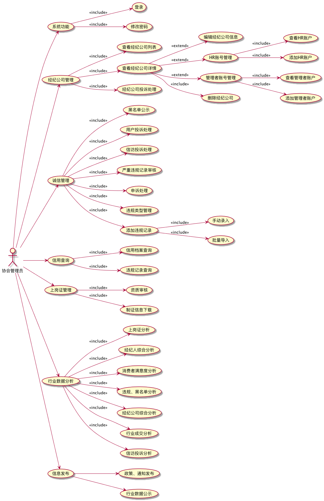

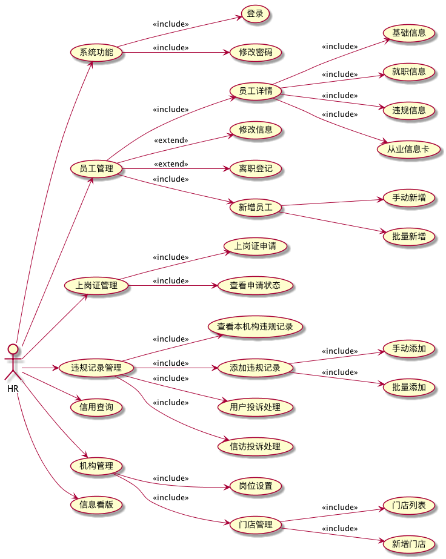

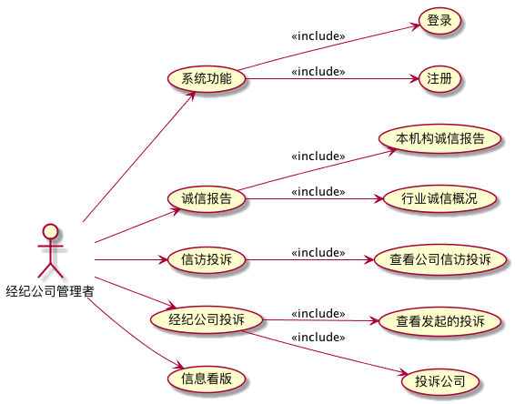

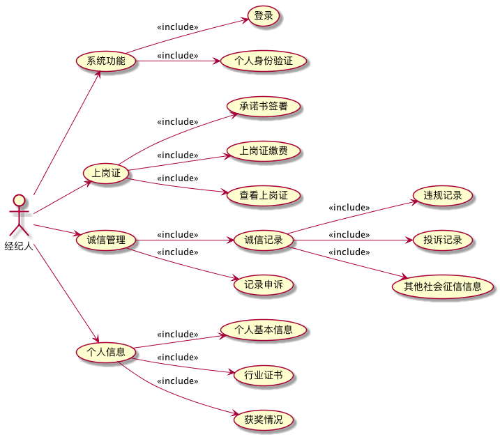

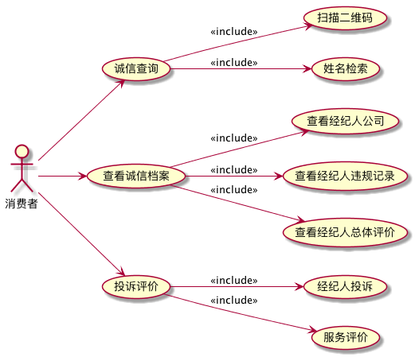

# 二、区块链在诚信体系中的应用

## 2.1 目的

通过区块链技术构建开放式的房地产行业经纪人诚信平台

## 2.2 项目展开方式

开创了行业核心企业+行业监管方合作的新模式，打造平等监管合作共赢的生态，以有效的解决行业的痛点问题，目前正通过核心企业的诚信行为数据串联，打造数据接入、数据验真、投诉应对等多个业务闭环，构建面向各级房地产从业人员多级多类的信用服务平台，以更好的服务行业各类人员

## 2.3 基于区块链的诚信体系与传统诚信体系的差别

### 2.3.1传统诚信体系

* 数据高度中心化
* 管理权限高度中心化

当所有数据和管理权限中心化以后就会产生以下问题：

* 服务器一旦被黑客攻击或者控制，所有的服务和数据都将被黑客控制
* 一旦服务器或者数据库发生网络问题、硬件故障或者软件错误等情况，造成数据丢失，丢失的数据很难恢复
* 用户使用该服务是因为信任服务提供商，但是如果服务提供商跑路或数据存储方恶意篡改信息，造成的损失不可估量。

### 2.3.2 区块链技术的优点

**1 去中心化**

由于使用分布式核算和存储，不存在中心化的硬件或管理机构，任意节点的权利和义务都是均等的，系统中的数据块由整个系统中具有维护功能的节点来共同维护：如果某个节点遇到网络问题、硬件故障、软件错误或者被黑客控制，均不会影响系统以及其他参与节点。问题节点在排除故障并完成数据同步之后，便可以随时再加入到系统中继续工作。正因为整个系统的正常运转不依赖于个别节点，所以每个节点可以有选择地下线，进行系统例行维护，同时还能保证整个系统的7×24小时不间断工作。

 

**2 新型协作机制，更高效**

对于公司间的大规模多边协作，区块链提供了不同于传统的方法：以对等的方式把参与方连接起来，由参与方共同维护一个系统，通过共识机制和智能合约来表达协作规则，实现更有弹性的协作方式。

 

**3 开放性**

系统是开放的，除了交易各方的私有信息被加密外，区块链的数据对所有人公开，任何人都可以通过公开的接口查询区块链数据和开发相关应用，因此整个系统信息高度透明。

**4 不可篡改性**

一旦信息经过验证并添加至区块链，就会永久的存储起来，除非能够同时控制住系统中超过51%的节点，否则单个节点上对数据库的修改是无效的，因此区块链的数据稳定性和可靠性极高。

**5 自治性** 

区块链采用基于协商一致的规范和协议(比如一套公开透明的算法)使得整个系统中的所有节点能够在去信任的环境自由安全的交换数据，使得对“人”的信任改成了对机器的信任，任何人为的干预不起作用。

### 2.3.3 区块链在房产经纪行业的应用分析

#### 业务痛点

* 虚假房源：中介平台/信息服务平台为了吸引流量与客源，发布虚假房源信息或者篡改房源信息。比如某个房产经纪人在58等房屋信息展示平台上发布一套假的房源信息（地段好，户型好，价格低）吸引用户联络此经纪人，取得联系后告知买家这套房子没有了，转而推荐真正要卖的房屋。
* 经纪公司、经纪人市场行为不规范，对他们的信用考量困难：传统方式下经纪公司、房产经纪人评价实际意义不大，纬度单一，没有评定证据，客户主观评价。需要一个综合各项指标的模型，考量指标项的数据不能被经纪公司隐瞒或者恶意篡改
* 看房和交易过程中会出现各种纠纷，证据难以追踪
  * 带看过程中经纪公司之间的互相跳单。经纪人A先带用户看房，经纪人B后来也带用户看了同一套房源（或者经纪人B根本没有带用户看房），但是用户最后却选择经纪人B进行后续交易。
  * 卖家同时和两家经纪公司签订房屋交易合同，骗取定金/房款
  * 签订交易合同的买家无力支付房款
* 没有一个可信的用户端口，供用户进行投诉和申请仲裁
  * 投诉通道放在经纪公司，经纪公司可以选择隐瞒投诉信息
  * 投诉通道放在政府/房管部门，谁来仲裁？仲裁的证据依旧需要从经纪公司/经纪人处获得，万一经纪公司篡改数据呢？证据的真实性无法保证

#### 解决方案

**1. 房源真实性保证**

房产信息登记上链，信息一旦登记不可篡改。即使后期出现房源信息纠纷（例如假房源、产权等）也能在区块链上查询初始登记信息，责权可追。通过平台认证的房源有认证标志，消费者放心，平台监管也更方便

**2. 带看纠纷问题，比如代看过程中的跳单纠纷**

可以将经纪人带看确认书登记在区块链上，跳单时从链上能够查询到带看时间的记录，对于抢单，跳单的行为给出补偿和管理

**3. 经纪公司、经纪人信用评级**

利用区块链，可以从经纪公司注册、经纪人注册甚至经纪人培训等环节就开始记录，经纪公司和经纪人的市场行为、行业经历、历史交易、交易纠纷/仲裁等信息都将记录在链上，链上的信息不可更改，都将作为信用评级的参考因素。利用智能合约也能够在链上实时评价和更新信用等级。信用记录对外可查，真实可靠。

**4. 用户投诉和虚假信息举报**

举报信息上链，举报证据记录在链，并且在区块链上追踪历史证据与投诉或者举报者的举报证据对比，链上社区成员共同裁决。

#### 构建房产经纪区块链社区

**1. 社区模型**

* 社区角色
  * 经纪公司/经纪人：向链上记录日常市场行为活动、交易信息
  * 协会：房产交易的行为规范监管
  * 政府部门：登记在册的房源信息提供者、法律认证的证据提供者
  * 第三方平台：平台信息对外展示的合作方，带来流量，推广平台获得消费者认同
  * 普通用户：投诉、举报、申请仲裁
  * 其他合作伙伴
* 在社区中各个参与方的地位是相等的，通过合作共同促进社区发展，实现房产经纪联盟化
* 每个参与方的账本/数据库上记录的区块链上的数据都是相同的，可以在数据访问层通过权限设置管理数据的可获得性

**2. 达成共识、互惠互利**

* 经纪公司、经纪人规范自己的市场行为 → 减少因自身原因造成的各种纠纷 → 提高自己的信用等级 → 获得更高的露出率 → 获得更多的流量 → 更多的业务量 → 为社区带来更多流量
* 消费者积极举报虚假房源、不合规经纪人行为 → 真实房源比例提高、经纪人业务更加规范 → 提高社区可行度，带来更高的用户流量
* 协会、政府能够直接获取市场数据和行为数据，方便更好的监控房产经纪行业
* 社区内部可以设计可行的激励方案，鼓励各方的参与和使用

**3. 与其他行业的合作与延伸构想**

* 与估价行业的合作：房屋基础信息、相似/周边房源的历史成交信息是被记录在链上并且可查询的，估价师可以参考这些信息给出更为准确的房屋估价，进行价格较准，平抑市场价格避免市场波动。
* 与信贷行业的合作：潜在买家在平台上登记个人信息时对买家的购买资格做评估，给出可选择的贷款方案，减少发生签订交易合同后无力支付、恶意贷款的情况；同时平台也能为信贷行业带来业务机会。

### 2.3.4 基于区块链的诚信体系流程示意

* 假设现在是由4个机构和协会共同组成了行业诚信联盟链，为方便解释，每个机构和协会各有1个节点（我们可以将节点理解为服务器）

* 某个用户与机构A的经纪人发生冲突，向机构A的节点提交投诉记录

* 机构A的HR/管理人员在机构内部审核用户投诉是否属实。
* 发现自己公司旗下的经纪人的确与用户发生冲突，判定为严重违规，提交协会审核

* 协会管理员审核记录后，判定为严重违规记录，登记到诚信联盟链上
* 诚信联盟链的底层P2P机制（点对点传输机制）使得这条违规记录最终被记录在每一个机构的节点上

* 最终诚信联盟链的每一个成员的服务器上都会存在这条记录

* 当某个机构想要招聘某人成为自己公司的业务员时，可以查询自己节点上的诚信记录
* 发现应聘者曾经在机构D就职，且就职期间有违规记录，因此不予考虑

* 信息的来源不仅局限在机构自己上传，包括协会、政府仲裁记录等都可能是数据的来源
* 而数据一旦被登记上链，那么在每一个诚信联盟链的成员服务器上都会有一份数据备份
* 假设经纪公司的机构信用受旗下员工的诚信记录影响，机构C因旗下员工违规和投诉记录过多，想要篡改诚信联盟上的记录
* 机构C只对自己的节点服务器有控制权，因此只能抹去自己服务器上的数据。其他联盟成员节点上的数据依旧存在，本机构员工的违规情况依旧被所有人知晓

* 联盟成员可以动态扩展，后期会有各个层级的个人信用数据汇总在诚信联盟体系内
* 数据源的增加也会推动整个诚信平台诚信算法的可信

* 基于诚信数据，可以打造各种服务模型
  * 行业人员管理服务
  * 行业人员持证上岗服务
  * 行业黑名单通报服务
  * 经纪人诚信记录查询服务
  * ....

# 三、核心业务流程

## 3.1 经纪公司管理

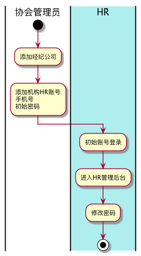

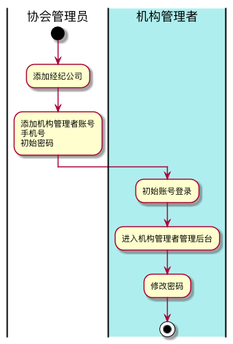

- 协会管理员添加经纪公司
- 添加完经纪公司以后，添加公司内各个角色的初始账号
  - HR
  - 经纪公司管理者
- 相应角色的人用初始账号登录自己的管理后台
- 登录成功后可以修改自己的密码

## 3.2 经纪人管理

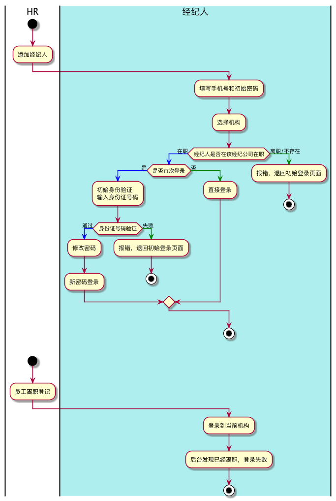

- HR在自己的管理后台进行员工的登记
- 在职经纪人在C端登录，选择自己当前的就职机构
  - 如果在选择的机构中没有经纪人的信息或者经纪人已经离职，那么初始登录失败
  - 如果经纪人时就职状态，那么需要验证经纪人是否是第一次使用系统
    - 第一次使用：身份验证（输入身份证号/拍摄身份证照片）
    - 非第一次使用：直接登录
  - 身份验证通过后，会提示经纪人修改密码。密码修改完成后，重新回到登录界面进行系统登录

## 3.3 违规记录管理

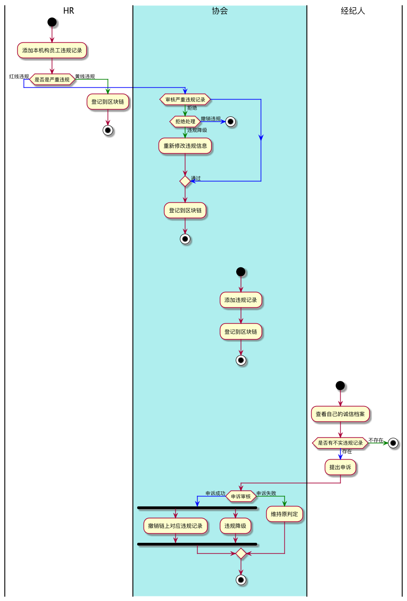

- HR可以提交本公司员工的违规记录信息
  - 如果HR添加的违规记录属于严重违规记录，则需要协会审核
- 协会对严重违规信息可以进行的处理包括：
  - 违规成立
  - 违规不成立
  - 违规降级：该违规行为仍然会被记录在区块链上，但是不会被判定为严重违规
- 协会可以直接添加来自其他外部来源的违规信息
  - 协会添加的严重违规记录，不需要协会自己再审核一遍
- 经纪人在C端登录系统后可以查看自己的诚信档案，诚信档案中包括自己过往的违规记录
  - 针对不实的违规记录，经纪人可以提出申诉，并附上申诉材料，由协会审核
- 协会对申诉的处理同样是：
  - 申诉成功，撤销链上这条记录；或者将违规等级降级
  - 申诉失败，维持原违规判定

## 3.4 经纪人信息卡管理

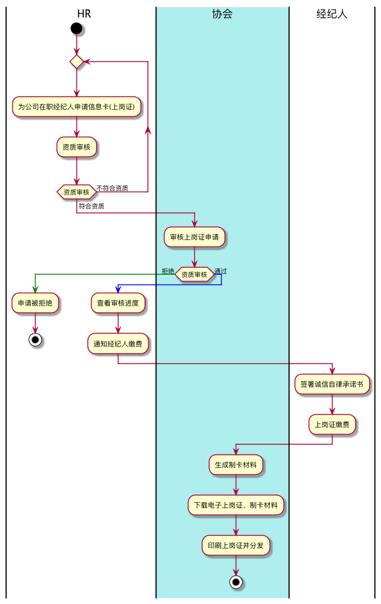

- HR替本公司员工发起上岗证申请
  - HR发起时，系统会自动进行资质审核，包括经纪人的必备材料是否齐全，经纪人在本次工作期间是否有重大违规
- 协会对各个经纪公司发来的上岗证申请进行审核
  - 在HR提交到协会审核这个区间段，经纪人很有可能会有新违规记录的产生，因此系统会在协会审核时再进行一次资质审核
- 审核通过后，协会告知HR，HR通知经纪人进行缴费
- 经纪人在C端登录后，能够查看自己当前上岗证的状态：
  - 所在企业HR尚未发起申请
  - 申请审核中
  - 审核通过
  - 需要签署诚信承诺书，诚信承诺书

## 3.5 信访投诉处理

## 3.6 消费者服务评价

## 3.7 消费者投诉

## 3.8 行业数据分析

# 四、页面交互

## 4.1 协会

> 测试地址 http://47.100.222.98
>
> 账号 13951729859
>
> 密码 house123

## 4.2 HR

> 测试地址 http://47.100.222.98
>
> 账号 15951814022
>
> 密码 123456

## 4.3 经纪公司管理者

> 测试地址 http://47.100.222.98
>
> 账号 18362983757
>
> 密码 123456

## 4.4 经纪人

> 测试地址 http://47.100.222.98/houseC/#/
>
> 账号 18811781596
>
> 密码 123456
>
> 机构 测试机构1

## 4.5 消费者

> 测试地址 http://47.100.222.98/houseC/#/customer/credit

可以检索姓名 测测40000、张玉荣

**正式服测试**

关注公众号：上海市房地产经纪行业诚信平台

点击下方"信用查询" 查询  卢大海

扫描二维码可以测试下方图片

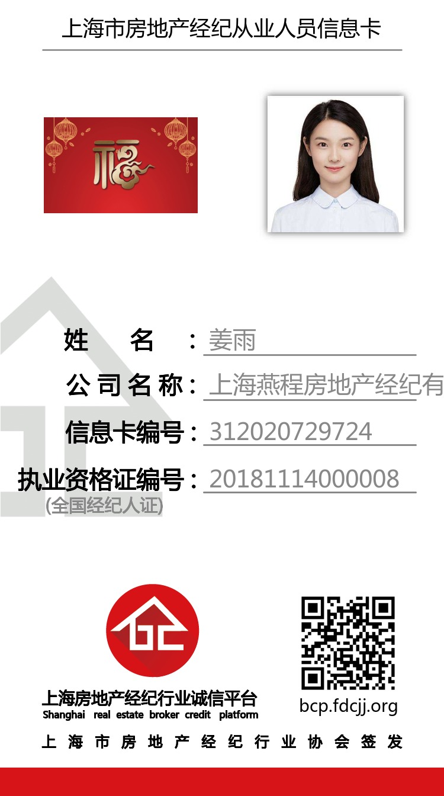

# 五、诚信体系安全管控

