# 一、原Freelancer分析

## 1.1 产品用例图

## 1.2 类图

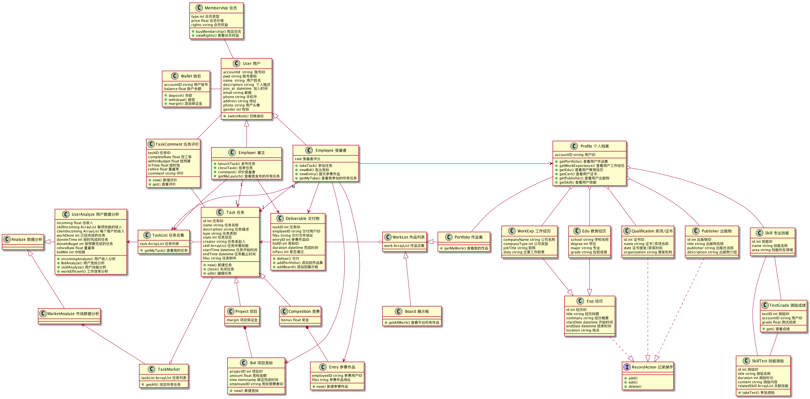

## 1.3 构件图

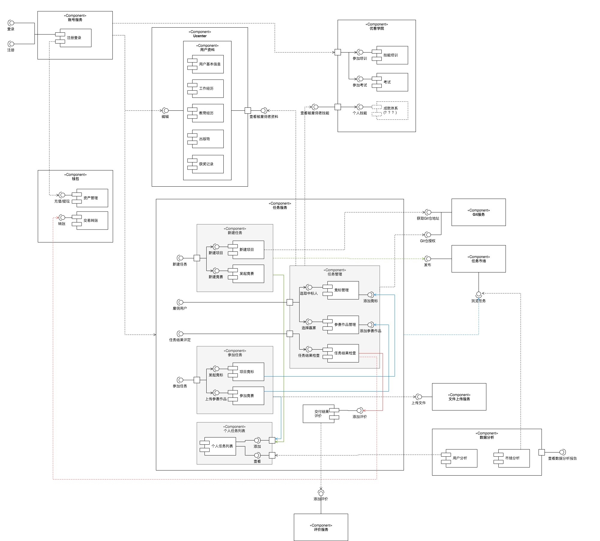

# 二、基于Freelancer改造的开发者社区

## 2.0 Freelancer局限性

1. 项目市场与开发环境剥离，开发者不能在平台直接开发和交付
2. 缺乏对项目的管理
3. 每个人都是独立的个体，在项目之外没有人员系统
4. 项目交付结果的裁定完全由雇佣者决定，没有公信力，容易引发纠纷
5. 钱包功能局限

## 2.1 需求定义

### 核心功能点

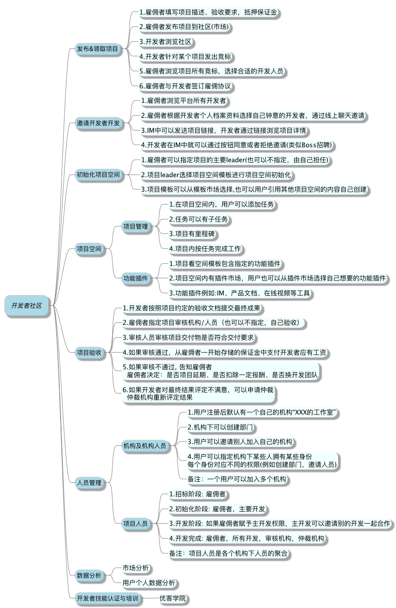

### 产品用例

## 2.2 结构设计

### 服务引用Topo图

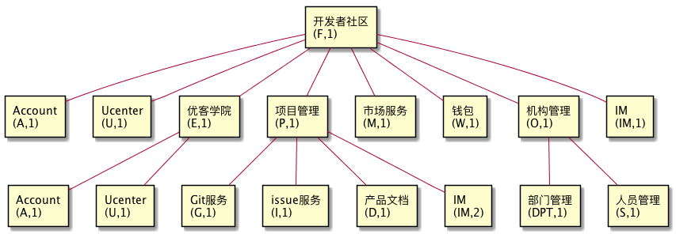

### 主框架-类图

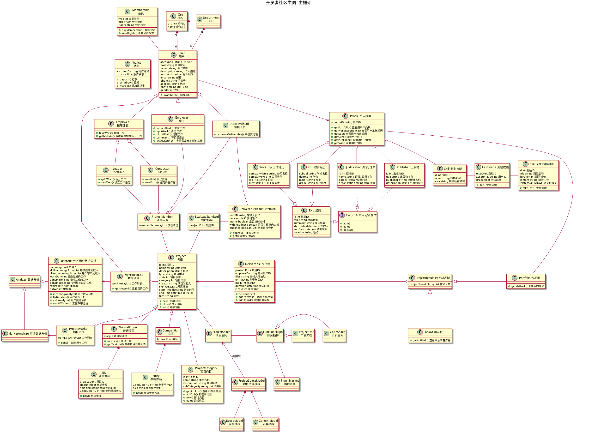

### 主框架-构件图

#### 1 项目发布与竞标

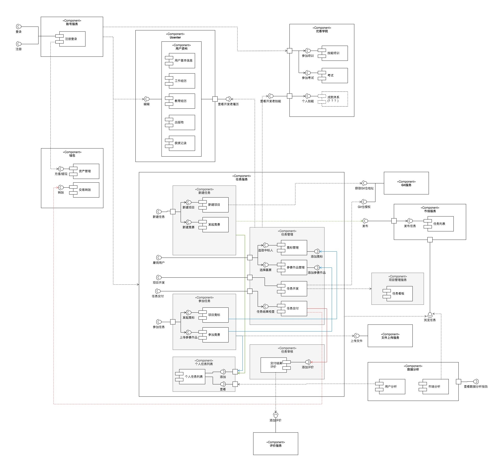

### 核心数据-ER图

## 2.3 原型设计

### 交互主框架

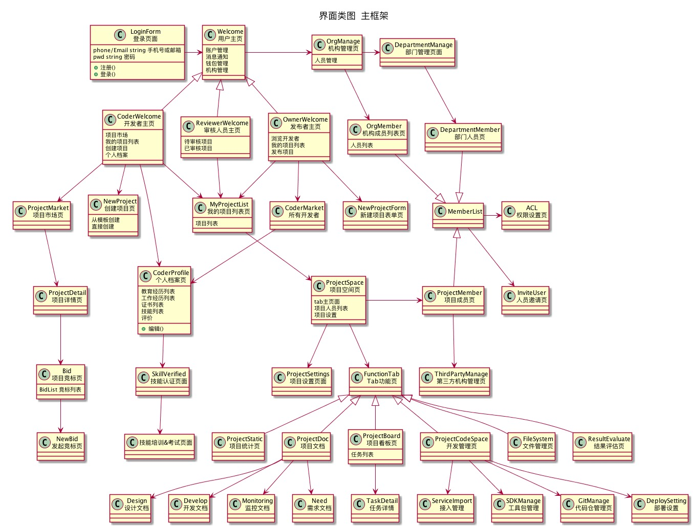

### 各板块页面大纲

#### 1 用户登录、人员&机构

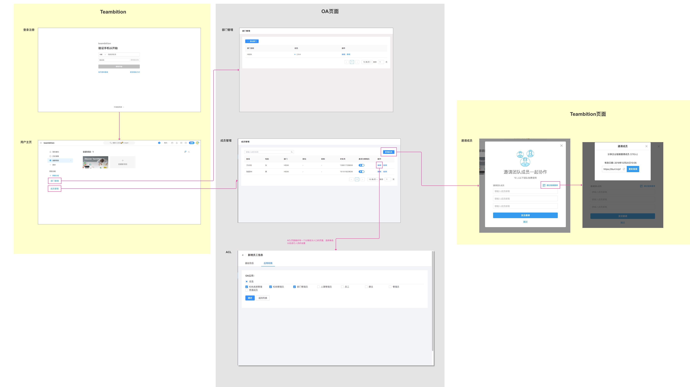

#### 2 任务市场

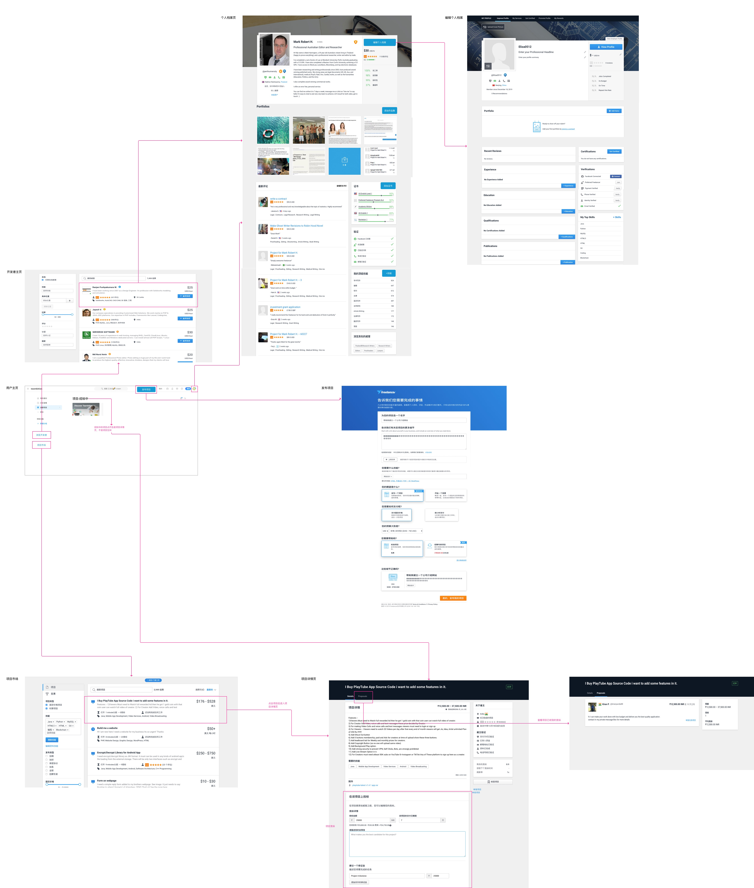

#### 3 项目管理

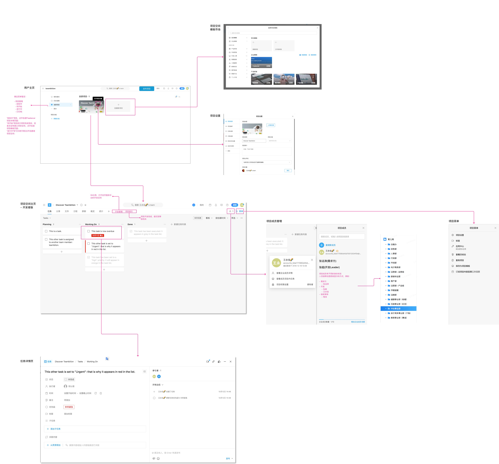

#### 4 项目空间

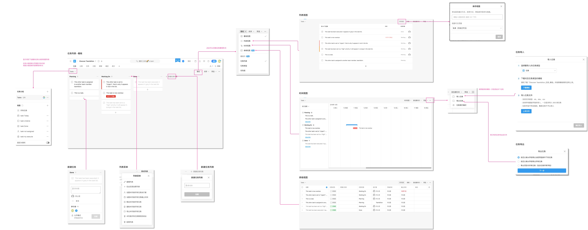

#### 5 核心插件

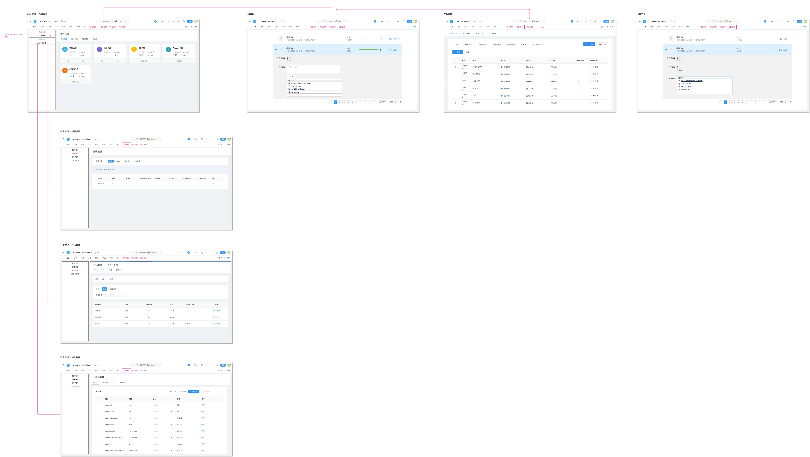