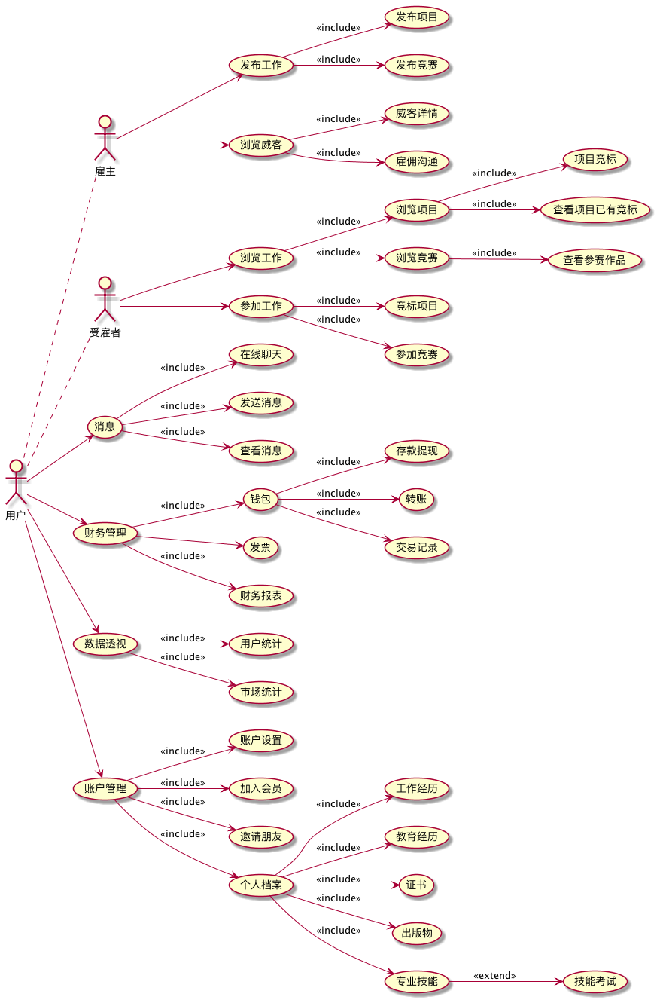

# FreeLancer产品分析

## 产品用例图



```uml

left to right direction
:用户: as User
:雇主: as User1
:受雇者: as User2


User .. User1
User .. User2
User1 --> (发布工作)
User1 --> (浏览威客)
User2 --> (浏览工作)
User2 --> (参加工作)
User --> (消息)
User --> (财务管理)
User --> (数据透视)
User --> (账户管理)

(发布工作) --> (发布项目):<<include>>
(发布工作) --> (发布竞赛):<<include>>

(浏览工作) --> (浏览项目):<<include>>
(浏览工作) --> (浏览竞赛):<<include>>

(浏览项目) --> (项目竞标):<<include>>
(浏览项目) --> (查看项目已有竞标):<<include>>

(浏览威客) --> (威客详情):<<include>>
(浏览威客) --> (雇佣沟通):<<include>>

(浏览竞赛) --> (查看参赛作品):<<include>>

(参加工作) --> (竞标项目):<<include>>
(参加工作) --> (参加竞赛):<<include>>

(消息) --> (在线聊天):<<include>>
(消息) --> (发送消息):<<include>>
(消息) --> (查看消息):<<include>>

(财务管理) --> (钱包):<<include>>
(财务管理) --> (发票)
(财务管理) --> (财务报表):<<include>>

(钱包) --> (存款提现):<<include>>
(钱包) --> (转账):<<include>>
(钱包) --> (交易记录): <<include>>

(数据透视) --> (用户统计):<<include>>
(数据透视) --> (市场统计):<<include>>

(账户管理) --> (账户设置):<<include>>
(账户管理) --> (加入会员):<<include>>
(账户管理) --> (邀请朋友):<<include>>
(账户管理) --> (个人档案):<<include>>

```

## 类图


