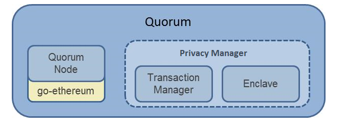

# Quorum介绍（一）：Quorum整体结构概述


> **Official Docs 官方文档**
>
> [https://docs.goquorum.com/en/latest/Getting%20Started/Getting%20Started%20Overview/](https://docs.goquorum.com/en/latest/Getting%20Started/Getting%20Started%20Overview/)

## 一、什么是Quorum?

一句话概括，就是企业级以太坊模型。与传统的以太坊模型不同，Quorum既然是企业级应用，那么准入门槛、共识处理以及交易的安全机制上一定与传统的公链模型不同。稍后我们也将从以下几个方面详细介绍Quorum的结构模型和核心功能特色。

- 共识
- 交易机制
- 安全框架
- 网络准入门槛设置

## 二、Quorum交易状态

Quorum本身支持两种交易状态

- 公有状态：网络中所有的Quorum节点都能获得及交易内容
- 私有状态：只有获得相应许可的节点才能解读。

两种交易核心不同就是内容是否加密。为了区别两种交易的类型，Quorum在每笔交易的签名中设置了一个特殊的value值，当签名中的value值为27或28时，表示这是一笔公开交易，如果是37或者38则是一笔私密交易。私密交易的内容会被加密，只有具有解密能力的节点才能获得具体的交易内容。

所以最终每个节点会有两套账本：一个是所有人都一样的公有账本，另一个是自己本地存储的私有账本。


所以Quorum的账本状态改变机制**允许以下几种情况的调用**

```
1. S -> A -> B
2. S -> (A) -> (B)
3. S -> (A) -> [B -> C]
```

s 表示交易发起者，(X) 表示私密， X表示公开

上述公式可以翻译为：

- 允许发起一笔公有交易，该公有交易合约可以调用另一个公有交易合约（公开智能合约调用公开智能合约）
- 允许发起一笔私有交易，该私有交易合约可以调用另一个私有交易合约（私有智能合约调用私有智能合约）
- 允许发起一笔私有交易，该私有交易可以只读另一个公有交易合约（私有交易读取公有账本信息，但不改变公有账本）

Quorum**不允许以下两种情况的调用**

```
1. (S) -> A
2. (S) -> (A)
```

- 私有合约调用公开合约
- (S) -> (A)这里笔者也比较模糊，不太明白


Quorum具体的状态状态校验（世界状态）可以调用RPC方法 eth_storageRoot(address[, blockNumber]) -> hash


## 三、Quorum部件分析

Quorum核心分为两大块：Node节点和隐私管理。



### Quorum节点

Quorum节点本身是一个轻量版的Geth。沿用Geth可以发挥以太坊社区原有的研发优势，因此Quorum会随着Geth未来的版本更新而更新。

Quorum节点基于Geth做了一下改动：

- 使用Raft或者是IBFT共识，而不是POW共识
- P2P层节点直接只进行可允许的连接（节点之间的连接必须获得许可，一般公网节点是没有接入限制的）
- 块的产生逻辑不再是“全局账本状态”决定，而是“全局公开账本”状态决定
- 块的验证逻辑不再是“全局账本状态”决定，而是“全局公开账本”状态决定
- 账本分为两部分：公共账本和私有账本
- 块验证逻辑支持“私有交易”
- 允许创建交易时交易内容是加密hash值，这样能确保私密交易的加密性
- 保留了gas的概念，但是交易不会产生gas费用


### Quorum安全管理 - Constellation & Tessera

Constellation和Tessera（以下简称C&T）是一种用Java和Haskell实现的安全传输信息模型，他们的作用就像是网络中的信息传输代理（MTA, Message Transfer Agent）所有消息的传输都通过会话信息秘钥进行加密

> PGP加密, 可以用来发送机密消息。这是通过对称的一组密钥-公钥组合来实现的。消息采用对称加密算法加密，采用一组对称密钥。每个对称密钥只使用一次，所以也叫做会话密钥。[PGP定义介绍](https://baike.baidu.com/item/PGP)

C&T其实是一种多方参与网络中实现个人消息加密的常用组件，在许多应用中都很常见，并不是区块链领域专有技术（笔者注，其实区块链本身就是各种技术的大杂烩，我们很难专门找到一门技术，说它就是区块链 ）。C&T主要包括两个子模块：

- The Node  Quorum使用这个模块实现了PrivateTransactionManager 私有交易管理
- The Enclave

####Transaction Manager 交易管理

交易管理模块主要负责交易的隐私，包括存储私密交易数据、控制私密交易的访问、与其他参与者的交易管理器进行私密交易载荷的交换。Transaction Manager 本身并不涉及任何私钥和私钥的使用，所有数字加密模块的功能都由The Enclave来完成。

Transaction Manager属于静态/Restful模组，能够非常容易的被加载。

#### The Enclave 

分布式账本协议通常都会涉及交易验证、参与者授权、历史信息存储（通过hash链）等。为了在加密这一方面实现平行操作的性能扩展和，所有公私钥生成、数据的加密/解密都由Enclave模块完成。


下一篇：[Quorum介绍(二)：Quorum共识](Quorum/quorum2.md) 