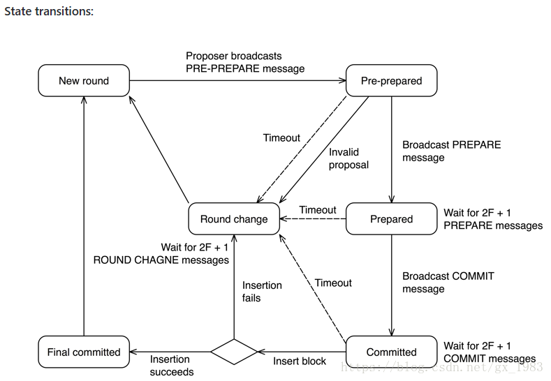

# Quorum介绍（二）：Quorum共识

> 本文篇幅较长，请耐心阅读

我们知道，公共区块链是一个开放的社区，任何人都能够成为一个节点加入网络，在网络中计算，提交交易到链上等，因此公链是没有信任基础的，所以公链的共识第一要义就是证明交易的合法性和真实性，防止恶意成员的捣乱，效率不是第一要义。

与公链的环境不同，有准入门槛的企业链或者联盟链链上的所有成员在加入时实际上是已经获得了某些认可和许可的，因此企业链/联盟链上的成员是有一定信任基础的。在企业级链上我们没有必要使用POW或者POS这种浪费算力或者低效的交易共识。

Quorum提供了多种共识供用户采用：

- Raft-based Consensus  Raft共识（在联盟链Hyperledger Fabric中也支持此种共识算法）
- Istanbul BFT (Byzantine Fault Tolerance) Consensus  IBFT共识
- Clique POA共识

## 一、Raft 共识

> **本节参考**
>
> [https://cloud.tencent.com/developer/news/221746](https://cloud.tencent.com/developer/news/221746)
> 
> [https://www.jianshu.com/p/8e4bbe7e276c](https://www.jianshu.com/p/8e4bbe7e276c)

### 1.什么是Raft

在讲Raft前，有必要提一下Paxos算法，Paxos算法是Leslie Lamport于1990年提出的基于消息传递的一致性算法。然而，由于算法难以理解，刚开始并没有得到很多人的重视。其后，作者在八年后，也就是1998年在ACM上正式发表，然而由于算法难以理解还是没有得到重视。而作者之后用更容易接受的方法重新发表了一篇论文《Paxos Made Simple》。

可见，Paxos算法是有多难理解，即便现在放到很多高校，依然很多学生、教授都反馈Paxos算法难以理解。同时，Paxos算法在实际应用实现的时候也是比较困难的。这也是为什么会有后来Raft算法的提出。

Raft是实现分布式共识的一种算法，主要用来管理日志复制的一致性。它和Paxos的功能是一样，但是相比于Paxos，Raft算法更容易理解、也更容易应用到实际的系统当中。而Raft算法也是联盟链采用比较多的共识算法。

#### 角色

Raft一共有三种角色状态：

1. Follower（群众）被动接收Leader发送的请求。所有的节点刚开始的时候是处于Follower状态。
2. Candidate（候选人）由Follower向Leader转换的中间状态
3. Leader（领导）负责和客户端交互以及日志复制（日志复制是单向的，即Leader发送给Follower），同一时刻最多只有1个Leader存在。


每个节点上都有一个倒计时器 (Election Timeout)，时间随机在 150ms 到 300ms 之间。有几种情况会重设 Timeout：

1. 收到选举的请求
2. 收到 Leader 的 Heartbeat

#### 任期

在分布式系统中，“时间同步”是一个很大的难题，因为每个机器可能由于所处的地理位置、机器环境等因素会不同程度造成时钟不一致，但是为了识别“过期信息”，时间信息必不可少。

Raft算法中就采用任期（Term）的概念，将时间切分为一个个的Term（同时每个节点自身也会本地维护currentTerm），可以认为是逻辑上的时间，如下图。


每一任期的开始都是一次领导人选举，一个或多个候选人（Candidate）会尝试成为领导（Leader）。如果一个人赢得选举，就会在该任期（Term）内剩余的时间担任领导人。在某些情况下，选票可能会被评分，有可能没有选出领导人（如t3），那么，将会开始另一任期，并且立刻开始下一次选举。Raft 算法保证在给定的一个任期最少要有一个领导人。

#### Leader选举


**特殊情况的处理**

1. 多个候选人
   1. 票数多的候选人成为leader
   2. 如果候选人平票，则本轮选举无效，进入下一轮选举。此时所有本轮的candidate + follower中先结束计时器的成为下一轮的候选人
   3. 新的leader产生后会向所有的节点发送heartbeat，这个时候剩余candidate自动恢复follower身份
2. 已有follower故障
   1. 剩余的节点因为没有收到来自leader的心跳信息，所以自动进入选举状态，选出新的leader(L2)
   2. L2工作期间如果旧leader（L1）故障恢复上线，因为L2的任期比L1的任期要新，所以其他节点只认L2的指令。
   3. L1在接收到L2的心跳之后也会自动降级成为Follower

#### 日志记录


### 2.以太坊中的Raft共识

在以太坊中节点本身并没有角色，因此在使用Raft共识时，我们称leader节点为挖矿节点：

- 只有挖矿节点有权产生新的块，而不用对自己的工作进行证明。
- 如果一个以太坊节点成为leader，那么它就会开始挖矿；如果它不再是leader，那么它就停止挖矿

| **Ethereum** | **Raft** |
| ------------ | -------- |
| minter       | leader   |
| verifier     | follower |

Raft共识机制本身保证了同一时间点最多只有一个leader，因此用在以太坊模型下也只会有一个出块者，避免了同时出块或者算力浪费的情况。

在单笔交易(transaction)层级Quorum依然沿用了Ethereum的p2p传输机制，只有在块(block)层级才会使用Raft的传输机制。

其中需要注意到一点，在以太坊中一个节点收到块以后就会立刻记账，而在Quorum模型中，一个块的记录必须遵从Raft协议，每个节点从leader处收到块以后必须报告给leader确认收到以后，再由leader通知各个节点进行数据提交（记录）


#### Quorum中一笔交易的生命周期


#### 链的延伸、竞争和校准

在Quorum模型中新块的信息是很有可能和已有块的header信息不符的，最容易发生这种情况的就是选举人更替(挖矿节点更替)，具体描述如下：

```
 time                   block submissions
                   node 1                node 2
  |    [ 0xbeda Parent: 0xacaa ]
  |
  |   -- 1 is partitioned; 2 takes over as leader/minter --
  |
  |    [ 0x2c52 Parent: 0xbeda ] [ 0xf0ec Parent: 0xbeda ]
  |                              [ 0x839c Parent: 0xf0ec ]
  |
  |   -- 1 rejoins --
  |
  v                              [ 0x8b37 Parent: 0x839c ]
```

假设有两个节点，node1和node2，node1是现有的leader，现有链的最新区块是0xbeda，它的父区块是0xacaa

- 假设node 1产生故障和网络中的其他节点通讯不上，在此期间node1产生了新的块0x2c52
- node1故障期间 node2被选举成为了新的挖矿节点(leader)，产生了两个新的区块0xf0ec 和 0x839c。其中0xf0ec已经被其他节点记账
- 假设node1恢复了通信，将0x2c52发送给其他节点，因为0x2c52的parent和现有的其他节点的最新区块header不一致，所以会被标记为no-op 无效区块
- 而node2 发送的0x839c的parent和其他节点最新区块的header一致，所以会被其他节点接收，标记为extends 有效区块，记录在账本上

对块“Extends”或者“No-op”的标记是在更上层完成的，并不由raft本身log记录机制实现。因为在raft内部，信息并不分为有效或无效，只有在区块链层面才会有有效区块和无效区块的含义。

需要注意的是，Quorum的这种记账机制和本身Ethereum的LVC（最长链机制）是完全不一样的

- LVC是为了解决链分叉问题
- Raft本身的记账特性就决定了Quorum不会产生链的分叉

#### 出块频率

Quorum的出块频率默认是50ms一个块，可以通过 --raftblocktime 参数进行设置

#### 投机性出块

投机性出块并不是以太坊Raft共识严格必须的核心机制之一，但是是提高出块效率的有效方式。

一个块从产生到实际被记录账本，走完整个raft流程实际上是需要耗费一定时间的。如果我们在上一个块被计入账本之后才开始产生下一个块，那么一笔交易想要成功被记录需要耗费较多的时间。

而在投机性(speculative minting)出块中，我们允许一个新块在它的父块被记录之前就产生。依次类推，在一段时间内，实际上会产生“投机链（speculative chain）”，在祖先块没有被记录进账本之前，一个一个新块已经依据先后关系组成了一条临时链片段，等待被记录。

对于已经被记录进投机块的交易，我们会在交易池中标记为“proposed transaction”

在之前我们说过，raft机制中是存在两个挖矿节点比赛出块和记账的可能的，因此，一条 speculative chain 中间的某一个块很有可能不会被记录到账本中。在这种情况下我们也会把交易池中的交易状态修改回来。([`InvalidRaftOrdering`](https://godoc.org/github.com/jpmorganchase/quorum/raft#InvalidRaftOrdering) event)

目前，Quorum并没有对speculative chain的长度做限制，但在它的未来规划中有讲这一点作为一个性能优化项加入开发进程，最后能够让一个挖矿节点即使在raft共识层没有连接上，它也可以离线一直出块，产生自己的speculative chain。

一条speculative chain有以下几个部分构成：

- `head`: 最先创建的块，如果最先创建的块已经被记录进区块链，head值为nil

- `proposedTxes`: 已经进入raft共识层，但还没有被计入账本的交易

- `unappliedBlocks`: 一个块队列，包含那些已经进入raft共识层但还没有被记录进区块链账本的块

  - 挖矿节点产生一个新块的时候，执行enqueue(new block)

  - `accept` 方法：当队列头部的块被记录进账本的时候，对这个块执行accept方法。

  - 当[`InvalidRaftOrdering`](https://godoc.org/github.com/jpmorganchase/quorum/raft#InvalidRaftOrdering) 事件发生时，将队列尾部的块全部pop up，直到所有依赖无效块的新块全部被pop up。

- `expectedInvalidBlockHashes`: 构建在无效块上但尚未通过 Raft 的块集（注意，已经通过raft共识层但还没有被记录账本的是`unappliedBlocks`，`unappliedBlocks`是有可能包含无效块的，详见上一条）。有时我们会用这些块集作为“guard”来避免对speculative chain的不必要修剪行为

#### Raft传输层

在块传输上我们使用etcd Raft默认的http传输，当然使用Ethereum的p2p传输也是可以的，但是Quorum团队在测试阶段发现，高负载的状态下，ETH p2p的性能没有raft p2p性能好。

Quorum使用50400端口作为Raft 传输层的默认监听端口，也可以通过`--raftport` 参数自行设置。

一个集群默认的最大节点个数是25，可以通过`--maxpeers N`来设置，N是你的最大节点个数。


> 更多的配置问题可以查阅官方手册 [Quorum FAQ page](https://docs.goquorum.com/en/latest/FAQ/)


## 二、IBFT共识

Quorum的IBFT其实就是PBFT，只不过摩根大通把它自己实现的PBFT叫做IBFT，所以IBFT的基本原理与PBFT是一样的，所不同的是,IBFT中把出块和共识的三阶段结合在了一起。

### 1 IBFT工作原理流程

Istanbul BFT修改自PBFT算法，包括三个阶段：`PRE-PREPARE`、`PREPARE`以及`COMMIT`。在`N`个节点的网络中，这个算法可以最多容忍`F`个出错节点，其中`N=3F+1`。

1. 在每一轮开始前，`validator`会选择其中一个作为`proposer`，默认以轮询的方式（除此之外还有sticky的方式，搜索`stickyProposer`方法去看细节）。
2. proposer会提出一个区块的proposal，并且广播`PRE-PREPARE`信息。
3. 一旦一个validator收到`PRE-PREPARE`信息，会把状态标记为`PRE-PREPARED`，然后广播`PREPARE`信息。这一步是为了确保所有的validator在同一个seqnence（proposal的高度）和round上进行共识验证。
4. 一旦收到`2F+ 1`个`PREPARE`信息，validator进入`PREPARED`状态然后广播`COMMIT`信息。这一步是为了通知节点的peer已经接收到了提出的区块，并且即将插入区块到链中。
5. 最后，validator等待`2F + 1`个`COMMIT`信息，然后进入`COMMITTED`状态然后插入区块到链中。

Istanbul BFT算法中的区块是确定的，意味着链没有分叉并且合法的区块一定是在链中。为了防止一个恶意节点生成不同的链，在把区块插入进链**之前**，每一个validator必须把`2F + 1`个`COMMIT`签名放进区块头的`extraData`字段。因此，区块是可以自我验证的（因为有签名）并且轻客户端也支持。

然而动态的`extraData`也会造成区块的hash计算问题。因为一个区块可以被不同的validator验证，所以会有不同的签名，所以同一个区块会有不同的hash。解决的方案是，计算区块hash的时候把`COMMIT`签名排除在外。因此我们任然可以在保证block hash一致性的同时进行共识验证。

### 2 IBFT中的状态与状态转换




#### 状态介绍

- `New Round`: 一个proposer发送新的区块proposal。validator等待`PRE-PREPARE`信息。
- `PRE-PREPARED`: 一个validator已经收到`PRE-PREPARE`信息，并且广播`PREPARE`信息。然后等待`2F + 1`个`PREPARE`或者`COMMIT`信息。
- `PREPARED`: 一个validator已经收到`2F + 1`个`PREPARE`信息，此时把自身状态标记为`PREPARED`，并且广播`COMMIT`信息。然后等待`2F + 1`个`COMMIT`信息
- `COMMITTED`: 一个validator已经收到`2F + 1`个`COMMIT`信息，此时把自身状态标记为`COMMITTED`，并且开始把提出的block插入链中。
- `FINAL COMMITTED`: 一个validator已经成功把区块成功插入了链中，此时把自身状态标记为`FINAL COMMITTED`，并且等待下一轮。
- `ROUND CHANGE`: 一个validator等待关于同一个round下的`2F + 1`个`ROUND CHANGE`信息。

#### 状态转换

- NEW ROUND -> PRE-PREPARED:
  - Proposer在txpool中收集交易。
  - Proposer提出一个区块proposal并且广播给validator。然后进入`PRE-PREPARED`状态。
  - 每一个validator进入到`PRE-PREPARED`状态，一旦收到`PRE-PREPARED`信息并且伴随着以下情况:
    - 区块proposal是来自于有效的proposer。
    - 区块头有效。
    - 区块proposal的sequence和round和validator的状态匹配。
  - Validator广播`PREPARE`信息给其他validators。
- PRE-PREPARED -> PREPARED:
  - Validator收到`2F + 1`个有效的`PREPARE`信息，因此而进入`PREPARED`状态。有效信息需要满足以下条件：
    - sequence和round匹配。
    - 交易hash匹配。
    - 信息是来自已知的validators。
  - 一旦进入`PREPARED`状态，Validator广播COMMIT信息。
- PREPARED -> COMMITTED:
  - Validator收到`2F + 1`个有效的`COMMIT`信息，以此进入`COMMITTED`状态。有效的信息需要满足以下条件：
    - sequence和round匹配。
    - block hash匹配
    - 信息是来自已知的validators。
- COMMITTED -> FINAL COMMITTED:
  - Validator把`2F + 1`个commitment签名放进区块头的`extraData`并且尝试插入区块进区块链。
  - 当插入区块成功，Validator进入`FINAL COMMITTED`状态。
- FINAL COMMITTED -> NEW ROUND:
  Validators选一个新的proposer开始新的一轮。


## 三、 Clique POA共识

由于Ethereum POA共识在网上已经有大量介绍，笔者这里就不多做详细介绍，只对重要特点和POA的工作流程做大致梳理和介绍

### 1 PoA的特点

- PoA是依靠预设好的授权节点(signers)，负责产生block.
- 可以由已授权的signer选举(投票超过50%)加入新的signer。
- 即使存在恶意signer,他最多只能攻击连续块(数量是 `(SIGNER_COUNT / 2) + 1)` 中的1个,期间可以由其他signer投票踢出该恶意signer。
- 可指定产生block的时间。

### 2 POA工作流程

1. 在创世块中指定一组初始授权的signers, 所有地址 保存在创世块Extra字段中
2. 启动挖矿后, 该组signers开始对生成的block进行 签名并广播。
3. 签名结果 保存在区块头的Extra字段中
4. Extra中更新当前高度已授权的 所有signers的地址 ,因为有新加入或踢出的signer
5. 每一高度都有一个signer处于IN-TURN状态, 其他signer处于OUT-OF-TURN状态, IN-TURN的signer签名的block会 立即广播 , OUT-OF-TURN的signer签名的block会 延时 一点随机时间后再广播, 保证IN-TURN的签名block有更高的优先级上链
6. 如果需要加入一个新的signer, signer通过API接口发起一个proposal, 该proposal通过复用区块头 Coinbase(新signer地址)和Nonce("0xffffffffffffffff") 字段广播给其他节点. 所有已授权的signers对该新的signer进行"加入"投票, 如果赞成票超过signers总数的50%, 表示同意加入
7. 如果需要踢出一个旧的signer, 所有已授权的signers对该旧的signer进行"踢出"投票, 如果赞成票超过signers总数的50%, 表示同意踢出


上一篇：[Quorum介绍(一)：Quorum整体结构概述](https://eliza0512.github.io/BlockchainBlog/Quorum/quorum1.html)

下一篇：

