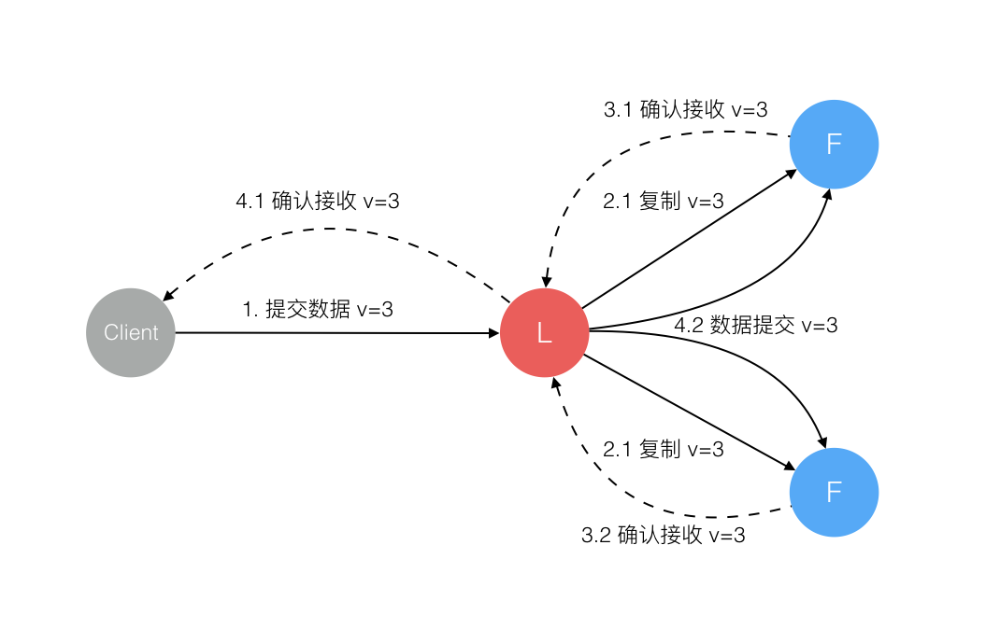

# Quorum介绍（二）：Quorum共识

> 本文篇幅较长，请耐心阅读

我们知道，公共区块链是一个开放的社区，任何人都能够成为一个节点加入网络，在网络中计算，提交交易到链上等，因此公链是没有信任基础的，所以公链的共识第一要义就是证明交易的合法性和真实性，防止恶意成员的捣乱，效率不是第一要义。

与公链的环境不同，有准入门槛的企业链或者联盟链链上的所有成员在加入时实际上是已经获得了某些认可和许可的，因此企业链/联盟链上的成员是有一定信任基础的。在企业级链上我们没有必要使用POW或者POS这种浪费算力或者低效的交易共识。

Quorum提供了多种共识供用户采用：

- Raft-based Consensus  Raft共识（在联盟链Hyperledger Fabric中也支持此种共识算法）
- Istanbul BFT (Byzantine Fault Tolerance) Consensus  IBFT共识
- Clique POA共识

## 一、Raft 共识

> **本节参考**
>
> [https://cloud.tencent.com/developer/news/221746](https://cloud.tencent.com/developer/news/221746)
> 
> [https://www.jianshu.com/p/8e4bbe7e276c](https://www.jianshu.com/p/8e4bbe7e276c)

### 1.什么是Raft

在讲Raft前，有必要提一下Paxos算法，Paxos算法是Leslie Lamport于1990年提出的基于消息传递的一致性算法。然而，由于算法难以理解，刚开始并没有得到很多人的重视。其后，作者在八年后，也就是1998年在ACM上正式发表，然而由于算法难以理解还是没有得到重视。而作者之后用更容易接受的方法重新发表了一篇论文《Paxos Made Simple》。

可见，Paxos算法是有多难理解，即便现在放到很多高校，依然很多学生、教授都反馈Paxos算法难以理解。同时，Paxos算法在实际应用实现的时候也是比较困难的。这也是为什么会有后来Raft算法的提出。

Raft是实现分布式共识的一种算法，主要用来管理日志复制的一致性。它和Paxos的功能是一样，但是相比于Paxos，Raft算法更容易理解、也更容易应用到实际的系统当中。而Raft算法也是联盟链采用比较多的共识算法。

#### 角色

Raft一共有三种角色状态：

1. Follower（群众）被动接收Leader发送的请求。所有的节点刚开始的时候是处于Follower状态。
2. Candidate（候选人）由Follower向Leader转换的中间状态
3. Leader（领导）负责和客户端交互以及日志复制（日志复制是单向的，即Leader发送给Follower），同一时刻最多只有1个Leader存在。


每个节点上都有一个倒计时器 (Election Timeout)，时间随机在 150ms 到 300ms 之间。有几种情况会重设 Timeout：

1. 收到选举的请求
2. 收到 Leader 的 Heartbeat

#### 任期

在分布式系统中，“时间同步”是一个很大的难题，因为每个机器可能由于所处的地理位置、机器环境等因素会不同程度造成时钟不一致，但是为了识别“过期信息”，时间信息必不可少。

Raft算法中就采用任期（Term）的概念，将时间切分为一个个的Term（同时每个节点自身也会本地维护currentTerm），可以认为是逻辑上的时间，如下图。


每一任期的开始都是一次领导人选举，一个或多个候选人（Candidate）会尝试成为领导（Leader）。如果一个人赢得选举，就会在该任期（Term）内剩余的时间担任领导人。在某些情况下，选票可能会被评分，有可能没有选出领导人（如t3），那么，将会开始另一任期，并且立刻开始下一次选举。Raft 算法保证在给定的一个任期最少要有一个领导人。

#### Leader选举


**特殊情况的处理**

1. 多个候选人
   1. 票数多的候选人成为leader
   2. 如果候选人平票，则本轮选举无效，进入下一轮选举。此时所有本轮的candidate + follower中先结束计时器的成为下一轮的候选人
   3. 新的leader产生后会向所有的节点发送heartbeat，这个时候剩余candidate自动恢复follower身份
2. 已有follower故障
   1. 剩余的节点因为没有收到来自leader的心跳信息，所以自动进入选举状态，选出新的leader(L2)
   2. L2工作期间如果旧leader（L1）故障恢复上线，因为L2的任期比L1的任期要新，所以其他节点只认L2的指令。
   3. L1在接收到L2的心跳之后也会自动降级成为Follower

#### 日志记录



### 2.以太坊中的Raft共识

在以太坊中节点本身并没有角色，因此在使用Raft共识时，我们称leader节点为挖矿节点：

- 只有挖矿节点有权产生新的块，而不用对自己的工作进行证明。
- 如果一个以太坊节点成为leader，那么它就会开始挖矿；如果它不再是leader，那么它就停止挖矿

| **Ethereum** | **Raft** |
| ------------ | -------- |
| minter       | leader   |
| verifier     | follower |

Raft共识机制本身保证了同一时间点最多只有一个leader，因此用在以太坊模型下也只会有一个出块者，避免了同时出块或者算力浪费的情况。

在单笔交易(transaction)层级Quorum依然沿用了Ethereum的p2p传输机制，只有在块(block)层级才会使用Raft的传输机制。

其中需要注意到一点，在以太坊中一个节点收到块以后就会立刻记账，而在Quorum模型中，一个块的记录必须遵从Raft协议，每个节点从leader处收到块以后必须报告给leader确认收到以后，再由leader通知各个节点进行数据提交（记录）


#### Quorum中一笔交易的生命周期


#### 链的延伸、竞争和校准

在Quorum模型中新块的信息是很有可能和已有块的header信息不符的，最容易发生这种情况的就是选举人更替(挖矿节点更替)，具体描述如下：

```
 time                   block submissions
                   node 1                node 2
  |    [ 0xbeda Parent: 0xacaa ]
  |
  |   -- 1 is partitioned; 2 takes over as leader/minter --
  |
  |    [ 0x2c52 Parent: 0xbeda ] [ 0xf0ec Parent: 0xbeda ]
  |                              [ 0x839c Parent: 0xf0ec ]
  |
  |   -- 1 rejoins --
  |
  v                              [ 0x8b37 Parent: 0x839c ]
```

假设有两个节点，node1和node2，node1是现有的leader，现有链的最新区块是0xbeda，它的父区块是0xacaa

- 假设node 1产生故障和网络中的其他节点通讯不上，在此期间node1产生了新的块0x2c52
- node1故障期间 node2被选举成为了新的挖矿节点(leader)，产生了两个新的区块0xf0ec 和 0x839c。其中0xf0ec已经被其他节点记账
- 假设node1恢复了通信，将0x2c52发送给其他节点，因为0x2c52的parent和现有的其他节点的最新区块header不一致，所以会被标记为no-op 无效区块
- 而node2 发送的0x839c的parent和其他节点最新区块的header一致，所以会被其他节点接收，标记为extends 有效区块，记录在账本上

对块“Extends”或者“No-op”的标记是在更上层完成的，并不由raft本身log记录机制实现。因为在raft内部，信息并不分为有效或无效，只有在区块链层面才会有有效区块和无效区块的含义。

需要注意的是，Quorum的这种记账机制和本身Ethereum的LVC（最长链机制）是完全不一样的

- LVC是为了解决链分叉问题
- Raft本身的记账特性就决定了Quorum不会产生链的分叉

#### 出块频率

Quorum的出块频率默认是50ms一个块，可以通过 --raftblocktime 参数进行设置


## 二、IBFT共识

## 三、 Clique POA共识


上一篇：[Quorum介绍(一)：Quorum整体结构概述](https://eliza0512.github.io/BlockchainBlog/Quorum/quorum1.html)

下一篇：

