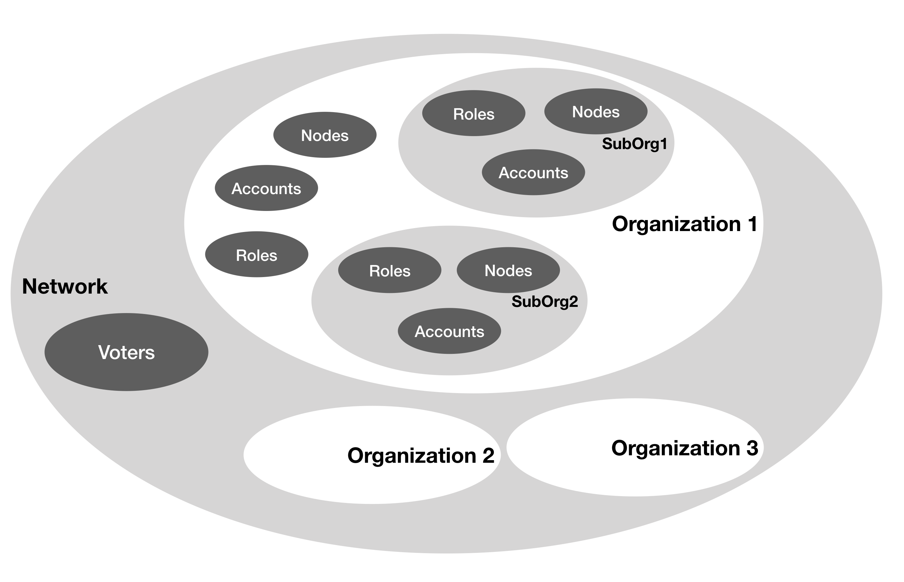
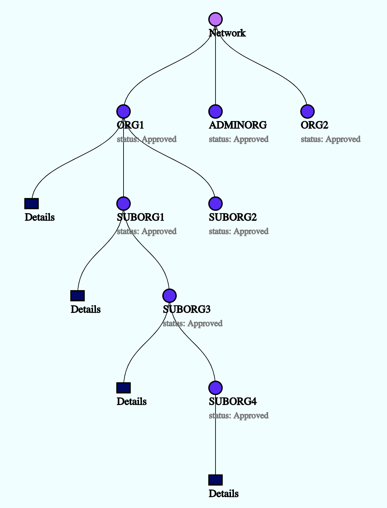
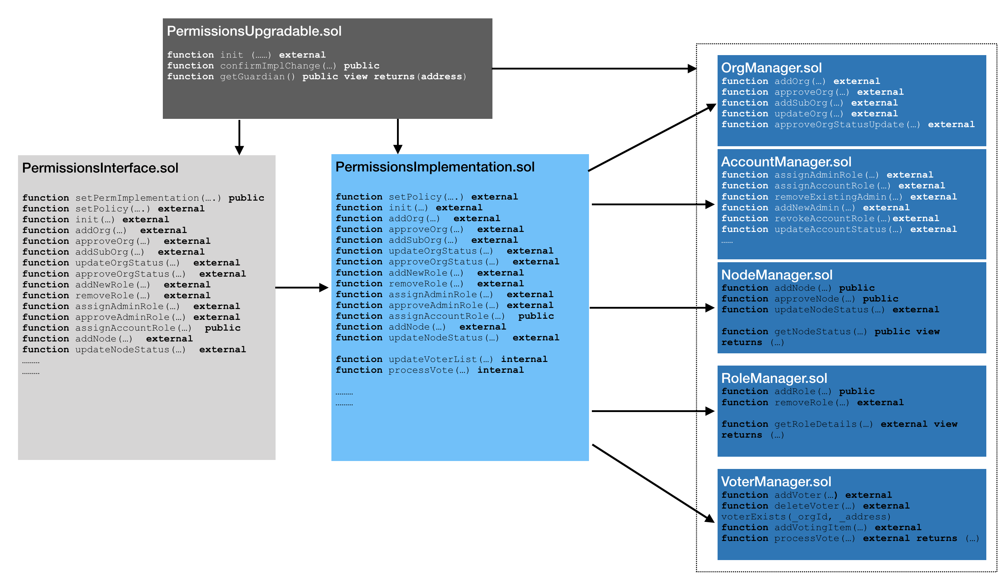

# Quorum介绍（三）：Quorum权限体系

> 本节详细介绍可以参考官方文档
>
> [https://docs.goquorum.com/en/latest/Permissioning/Overview/](https://docs.goquorum.com/en/latest/Permissioning/Overview/)


Quorum目前的许可系统只限于节点等级的许可，只有在`permission-nodes.json`文件中定义的节点才能够加入网络。这个准许模型已经要被优化成基于智能合约的授权许可模型，新模型在管理节点、账户和账户权限管理上都有一定灵活度，整体框架模型如下图所示



在优化模型结构图中，一个网络聚合了一群组织。网络层级有网络管理员账号，网络管理员可以提议和投票新组织加入网络，也可以指定某个账号为机构管理员账号。

机构管理员账号可以创建机构内角色、子机构、为自己机构下的账号赋予某种角色的功能，指定某个节点为本机构节点。子机构也可以创建自己的角色、子机构、节点。。。机构管理账号在机构层面管理和控制各项行为活动。父级机构管理原可以创建管理员角色，并将该角色的功能赋予其他账号。



## 一、智能合约设计

> [Github智能合约文件地址](https://github.com/jpmorganchase/quorum/tree/master/permission/contract)



Quorum权限系统智能合约的设计遵循`Proxy-Implementation-Storage pattern`（代理-实现-存储 模式），采用该模式可以保证及时业务逻辑层改变，也不会影响数据存储层和接口层的。智能合约的具体描述如下：

- `PermissionsUpgrade.sol`存储implementation合约的地址，这份合约地址只有guardian账户可以操作改变
- `PermissionsInterface.sol`接口定义，不含任何业务逻辑，会将接收到的请求转发给业务合约
- `PermissionsImplementation.sol`包含所有授权系统的操作逻辑。只接收在 `PermissionsUpgradable.sol` 中定义的接口请求，并根据相应操作和对应的存储合约交互
- `OrgManager.sol`存储机构和子机构信息，只接受来自 `PermissionsUpgrade.sol`合约中定义的implementation合约地址的请求

- `AccountManager.sol`存储所有账户相关的信息，包括账户和组织和归属关系，一个账户地址有哪些权限等。同时也存储一个账号的状态：`PendingApproval`, `Active`, `Inactive`, `Suspended`, `Blacklisted` or `Revoked`

- `NodeManager.sol`存储所有和节点相关的数据，包括节点和机构、子机构的关系，节点的状态： `PendingApproval`, `Approved`, `Deactivated` or `Blacklisted`

- `RoleManager.sol`同样只接收在 `PermissionsUpgrdable.sol`定义的implementation合约的请求。 存储角色和组织的关系。角色能够包括的权限如下：

  - `Readonly`只读权限
  - `Transact` 只能交易，不能部署合约
  - `ContractDeploy` 可以交易，也可以部署合约
  - `FullAccess` 全权限

  如果一个角色被撤销，那么所有被赋予这个角色的账户都会失去角色原有的权限。

- `VoterManager.sol`存储网络管理员信息。在创建网络时会预先定义一系列的网路管理员账号，这些账号都会被记录在本合约中。一旦网络层级有需要投票的事件发生，投票事件也会被记录在本合约中。

## <a name='init'>二、权限模型的部署</a>

- 部署网络初始节点
- 部署`PermissionsUpgradable.sol`合约。部署该合约时，作为参数需要指定一个guardian账号地址
- 部署剩余的合约。部署剩余合约的时候都需要`PermissionsUpgradable.sol`合约地址作为部署参数
- 所有合约部署完成后，按以下格式创建`permission-config.json`文件

```json
{
    "upgradableAddress": "0x1932c48b2bf8102ba33b4a6b545c32236e342f34",
    "interfaceAddress": "0x4d3bfd7821e237ffe84209d8e638f9f309865b87",
    "implAddress": "0xfe0602d820f42800e3ef3f89e1c39cd15f78d283",
    "nodeMgrAddress": "0x8a5e2a6343108babed07899510fb42297938d41f",
    "accountMgrAddress": "0x9d13c6d3afe1721beef56b55d303b09e021e27ab",
    "roleMgrAddress": "0x1349f3e1b8d71effb47b840594ff27da7e603d17",
    "voterMgrAddress": "0xd9d64b7dc034fafdba5dc2902875a67b5d586420",
    "orgMgrAddress" : "0x938781b9796aea6376e40ca158f67fa89d5d8a18",
    "nwAdminOrg": "ADMINORG",
    "nwAdminRole" : "ADMIN",
    "orgAdminRole" : "ORGADMIN",
    "accounts":["0xed9d02e382b34818e88b88a309c7fe71e65f419d", "0xca843569e3427144cead5e4d5999a3d0ccf92b8e"],
    "subOrgBreadth" : 3,
    "subOrgDepth" : 4
}
```

- 使用guardian account调用`PermissionsUpgradable.sol`的init服务

  - 使用geth加载以下内容

    ```
    ac = eth.accounts[0];
    web3.eth.defaultAccount = ac;
    var abi = [{"constant":true,"inputs":[],"name":"getPermImpl","outputs":[{"name":"","type":"address"}],"payable":false,"stateMutability":"view","type":"function"},{"constant":false,"inputs":[{"name":"_proposedImpl","type":"address"}],"name":"confirmImplChange","outputs":[],"payable":false,"stateMutability":"nonpayable","type":"function"},{"constant":true,"inputs":[],"name":"getGuardian","outputs":[{"name":"","type":"address"}],"payable":false,"stateMutability":"view","type":"function"},{"constant":true,"inputs":[],"name":"getPermInterface","outputs":[{"name":"","type":"address"}],"payable":false,"stateMutability":"view","type":"function"},{"constant":false,"inputs":[{"name":"_permInterface","type":"address"},{"name":"_permImpl","type":"address"}],"name":"init","outputs":[],"payable":false,"stateMutability":"nonpayable","type":"function"},{"inputs":[{"name":"_guardian","type":"address"}],"payable":false,"stateMutability":"nonpayable","type":"constructor"}];
    var upgr = web3.eth.contract(abi).at("0x1932c48b2bf8102ba33b4a6b545c32236e342f34"); // address of the upgradable contracts
    var impl = "0xfe0602d820f42800e3ef3f89e1c39cd15f78d283" // address of the implementation contracts
    var intr = "0x4d3bfd7821e237ffe84209d8e638f9f309865b87" // address of the interface contracts
    ```

  - 执行 `upgr.init(intr, impl, {from: <guardian account>, gas: 4500000})`

- 关闭所有geth节点，并将`permission-config.json`文件拷贝进每个节点的data文件夹下

-  将所有`geth`节点以 `--permissioned` 方式启动

## 三、API文档

> 参见 [https://docs.goquorum.com/en/latest/Permissioning/Permissioning%20apis/](https://docs.goquorum.com/en/latest/Permissioning/Permissioning apis/)

## 四、使用方法

### 1 初始化网络

具体操作方法可以参照本章[第二节权限模型的部署](#init)

- 假设初始节点的配置文件`static-nodes.json`的内容如下：

  ```json
  [
      "enode://72c0572f7a2492cffb5efc3463ef350c68a0446402a123dacec9db5c378789205b525b3f5f623f7548379ab0e5957110bffcf43a6115e450890f97a9f65a681a@127.0.0.1:21000?discport=0",
      "enode://7a1e3b5c6ad614086a4e5fb55b6fe0a7cf7a7ac92ac3a60e6033de29df14148e7a6a7b4461eb70639df9aa379bd77487937bea0a8da862142b12d326c7285742@127.0.0.1:21001?discport=0",
      "enode://5085e86db5324ca4a55aeccfbb35befb412def36e6bc74f166102796ac3c8af3cc83a5dec9c32e6fd6d359b779dba9a911da8f3e722cb11eb4e10694c59fd4a1@127.0.0.1:21002?discport=0",
      "enode://28a4afcf56ee5e435c65b9581fc36896cc684695fa1db83c9568de4353dc6664b5cab09694d9427e9cf26a5cd2ac2fb45a63b43bb24e46ee121f21beb3a7865e@127.0.0.1:21003?discport=0"
  ]
  ```

- 网络的权限配置如下

  ```json
  > quorumPermission.orgList
  [{
      fullOrgId: "ADMINORG",
      level: 1,
      orgId: "ADMINORG",
      parentOrgId: "",
      status: 2,
      subOrgList: null,
      ultimateParent: "ADMINORG"
  }]
  > quorumPermission.getOrgDetails("ADMINORG")
  {
    acctList: [{
        acctId: "0xed9d02e382b34818e88b88a309c7fe71e65f419d",
        isOrgAdmin: true,
        orgId: "ADMINORG",
        roleId: "ADMIN",
        status: 2
    }, {
        acctId: "0xca843569e3427144cead5e4d5999a3d0ccf92b8e",
        isOrgAdmin: true,
        orgId: "ADMINORG",
        roleId: "ADMIN",
        status: 2
    }],
    nodeList: [{
        orgId: "ADMINORG",
        status: 2,
        url: "enode://72c0572f7a2492cffb5efc3463ef350c68a0446402a123dacec9db5c378789205b525b3f5f623f7548379ab0e5957110bffcf43a6115e450890f97a9f65a681a@127.0.0.1:21000?discport=0"
    }, {
        orgId: "ADMINORG",
        status: 2,
        url: "enode://7a1e3b5c6ad614086a4e5fb55b6fe0a7cf7a7ac92ac3a60e6033de29df14148e7a6a7b4461eb70639df9aa379bd77487937bea0a8da862142b12d326c7285742@127.0.0.1:21001?discport=0"
    }, {
        orgId: "ADMINORG",
        status: 2,
        url: "enode://5085e86db5324ca4a55aeccfbb35befb412def36e6bc74f166102796ac3c8af3cc83a5dec9c32e6fd6d359b779dba9a911da8f3e722cb11eb4e10694c59fd4a1@127.0.0.1:21002?discport=0"
    }, {
        orgId: "ADMINORG",
        status: 2,
        url: "enode://28a4afcf56ee5e435c65b9581fc36896cc684695fa1db83c9568de4353dc6664b5cab09694d9427e9cf26a5cd2ac2fb45a63b43bb24e46ee121f21beb3a7865e@127.0.0.1:21003?discport=0"
    }],
    roleList: [{
        access: 3,
        active: true,
        isAdmin: true,
        isVoter: true,
        orgId: "ADMINORG",
        roleId: "ADMIN"
    }],
    subOrgList: null
  }
  ```

### 2 提议新组织加入网络

一旦网络部署完成以后，网络管理员账号可以提议一个新的组织加入网络。网络中所有的管理员账号会对这件事进行投票，投票通过后新组织被允许加入网络。

具体操作执行可以查看API文档中的[proposing](https://docs.goquorum.com/en/latest/Permissioning/Permissioning%20apis/#quorumpermission_addorg) 和 [approving](https://docs.goquorum.com/en/latest/Permissioning/Permissioning%20apis/#quorumpermission_approveorg) 操作

> 具体步骤示意可以查看官方文档说明
>
> [https://docs.goquorum.com/en/latest/Permissioning/Usage/#proposing-a-new-organization-into-the-network](https://docs.goquorum.com/en/latest/Permissioning/Usage/#proposing-a-new-organization-into-the-network)

**步骤**

1. 提议
2. 查看提议的组织状态
3. 投票
4. 投票结果超过半数，同意新组织节点加入
5. 新组织的节点加入网络。如果当前网络使用的是raft共识，需要注意，在新组织节点加入网络时要确保：
   1. 新的节点在raft层已经被添加为peer `raft.addPeer(<<enodeId>>)`
   2. 根据上一步获得的raft peer id，使用`geth`以`--raftjoinexisting`模式启动新节点

### 3 组织管理员管理和准入许可

```shell
> quorumPermission.addSubOrg("ORG1", "SUB1", "enode://239c1f044a2b03b6c4713109af036b775c5418fe4ca63b04b1ce00124af00ddab7cc088fc46020cdc783b6207efe624551be4c06a994993d8d70f684688fb7cf@127.0.0.1:21006?discport=0", {from: eth.accounts[0]})
"Action completed successfully"
> quorumPermission.getOrgDetails("ORG1.SUB1")
{
  acctList: null,
  nodeList: [{
      orgId: "ORG1.SUB1",
      status: 2,
      url: "enode://239c1f044a2b03b6c4713109af036b775c5418fe4ca63b04b1ce00124af00ddab7cc088fc46020cdc783b6207efe624551be4c06a994993d8d70f684688fb7cf@127.0.0.1:21006?discport=0"
  }],
  roleList: null,
  subOrgList: null
}
```

添加子机构并不是强制性的，如果机构管理员想为新创建的子机构添加一个管理账号，那么机构管理员首先需要

1. 创建一个具有isAdmin权限的角色，并赋予子机构下某个账户这个角色 [API](https://docs.goquorum.com/en/latest/Permissioning/Permissioning%20apis/#quorumpermission_addnewrole)
2. 将新建的角色赋予子机构的账号

需要注意的一点，上级机构拥有本机构和自己子机构的所有管理权限，而子机构管理员只拥有自己组织的管理权限。

### 4 暂停某个机构

1. 网络管理员(Network Admin) 提议修改某个组织的状态为“暂时关闭”
2. 所有网络管理员针对此条提议进行投票

### 5 组织层/网络层管理权限的授予

在某些情况下，我们可以一个账号同时具有机构管理员的权限和网络管理员的权限。同样也是需要进过两个步骤

1. 提议
2. 投票


上一篇：[Quorum介绍(二)：Quorum共识](https://eliza0512.github.io/BlockchainBlog/Quorum/quorum2.html)

下一篇：[Quorum介绍(四)：Quorum隐私体系之Tessera](https://eliza0512.github.io/BlockchainBlog/Quorum/quorum4.html)

