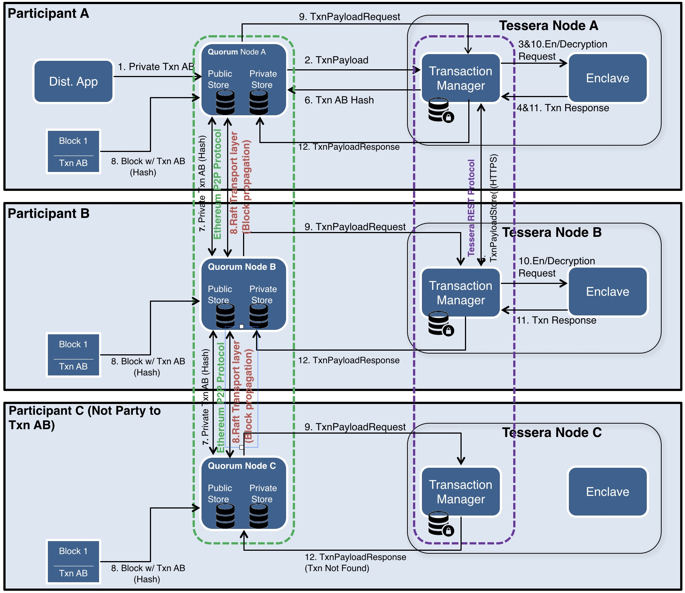

# Quorum介绍(四)：Quorum隐私体系之Tessera

Tessera是一个无状态的java系统，主要用来保证Quorum中的加密、解密和私有交易的分布式。

每个Tessera节点：

- 生成和保存许多公私钥对
- 自我管理，通过公钥和尽可能少的节点链接，在通过自己链接的这些节点进而发现整个网络的所有节点
- 提供公开和私密的API通讯接口：
  - 私密API-主要用于Quorum内部的通讯
  - 公开API-主要用于Tessera节点之间的通讯
- 基于多种信任模型提供双向SSL通讯，包括TLS证书、TOFU(Trust On First Use)、白名单、证书授权等
- 支持IP 白名单
- 可以连接任何支持JDBC的SQL数据库

## 一、Tessera 工作流程

上图展示的流程是Quorum一笔私密交易的流程，这笔交易只有参与者A与参与者B知道，C并不是这笔交易的成员。

1. A 向Quorum节点发送一笔交易，注明具体的交易payload，并且设置`privateFor`字段的值为A(可选)和B的公钥

2. A的Quorum节点将这笔交易发送给自己配套的Tessera Node A的`交易管理器`，交易管理器存储交易的payload

3. Tessera Node A的`交易管理器`把这笔交易发给`Enclave`组件，`Enclave`组件进行交易发起者（A）的身份校验（私钥签名和公钥校验）并且加密payload

4. `Enclave`的加密过程：

   1. 随机生成一个主钥 RMK和一个随机数

   2. 根据上一步生成的RMK和随机数加密交易payload

   3. 遍历交易参与方（在本例中是A和B）

      3.1针对每个参与方：根据`Enclave`和每个参与方的公钥，生成共享秘钥；生成一个随机数。

      3.2根据共享秘钥和随机数加密RMK。这样保证了每个加密RMK对每一个交易参与方是独一无二的，并且只能由该参与方读取

   4. 返回第二小步生成的加密payload和第三小步生成的所有加密RMKs给`交易处理器`

5. A的`交易处理器`计算加密载荷的哈希值并且在数据库中存储(加密payload, hash, 加密RMKs)

6. A的`交易管理器`通过HTTPS向B的`交易管理器`发送加密payload，和专门给B的共享钥匙+随机数。B接收到以后回复Ack/Nack。

7. A的`交易管理器`在收到B的接收回复后，将交易的hash值发送给A的Quorum节点，Quorum节点会用hash值替换原有的交易payload并且将交易的V值改为37或38，向其他节点表明这是一笔私有交易

8. 随后这笔交易会利用原有的Etherum P2P通信在节点之间同步

9. 一个包含该交易的块被打包出来，并发送给网络中的所有节点

10. 在处理块时，所有的节点都会处理这条交易，发现交易V值为37或38，Quorum节点会把交易的内容（Hash值）发给自己对应的Tessera节点的`交易处理器`，交易处理器根据hash值查找自己的数据库，看自己是否能够解密该笔交易

11. 因为C不是这笔交易的参与反，所有C的Quorum节点会收到`交易处理器`的`NotARecipient`回复，然后C会跳过这笔交易，并且不会改变自己的Priviate stateDB。

12. A和B的`交易处理器`会发现自己能够处理这笔交易，因此会调用`Enclave`，向其传入加密payload，加密的秘钥和交易签名等。

13. `Enclave`验证交易签名，然后用`Enclave`存储的私钥解密获得RMK，再用RMK解密payload获得交易明文。

14. A和B的`交易处理器`将解密后的交易内容发送给EVM执行执行智能合约。本次智能合约的执行只会更新Quorum节点的Private stateDB。（备注：一旦交易被执行以后，这条执行记录就被废弃了，如果想要读取交易内容必须重新按上述流程走一遍Quorum私有交易）

## 二、Tessera节点配置说明

因为配置文件不涉及本身Tessera的架构和概念说明，因此这里不做展开。感兴趣的读者可以直接阅读官方文档，查看每一配置项的说明

[Quorum配置说明](https://docs.goquorum.com/en/latest/Privacy/Tessera/Configuration/Configuration%20Overview/)

## 三、Tessera服务

本节会再详细展开说明关于`交易处理器`、`Enclave`相关的概念

### 1 交易处理器

交易处理器在整个私有交易流程中起到的作用可以查看本章第一节，这里总结概括一下，交易处理器主要有以下几个作用：

- Tessera节点P2P网络的基础，Tessera节点是通过交易处理器模块进行节点间通讯的
- 和`Enclave`组件之间进行payload加密/解密的沟通
- 向数据库存储和读取数据（注意，Tessera节点的数据库是通过JDBC外挂的）
- 和Quorum节点进行沟通

注意，交易处理器必须通过Enclave进行数据的加密解密，本身不能访问任何公私钥，也不能进行任何的数据加密和解密，最大程度保证了数据的安全性。

另外Tessera在启动时，可以通过`-Dspring.profiles.active=enable-sync-poller`指定是否启用数据恢复功能。启用该功能以后，Tessera节点每连接上一个新的节点都会发送一个“resend request”请求，收到该请求的节点会将自己数据库中的交易数据再次发送给每个交易参与方。（收到请求的节点并不会用交易数据回复发送请求的节点，因为发送请求的节点不一定是交易参与方）

### 2 Enclave

Enclave更像是一个接收命令处理数据的黑盒，Enclave可以以软件形式存在也可以以硬件的形式存在，无论是哪一种形式，其目的都是为了保证信息只在Enclave内部，不会被恶意攻击盗取。

Tessera Enclave主要的作用是进行数据的加密/解密，已经公私钥对的生成和管理。这就保证了在程序中有一个安全的地方可以进行数据的加密解密处理，同时敏感信息不会流入程序内存被不必要的参与方读取。如果采用硬件Enclave，也保证程序能够以更小的体积运行在一个安全环境中。

Enclava存储的数据：

- 公私钥访问
- 交易参与方的公钥(这部分信息不涉及敏感数据，其实可以放到`交易管理器中`)
- 默认连接节点(Tessera节点，不是Quorum)的公钥

Enclave可以处理的请求：

- 获取默认连接节点(Tessera节点)的公钥
- 为每笔交易提供forwarding keys(推送公钥)
- 当前Enclave保存的所有公钥
- 为给定发送者和参与者的交易载荷加密
- 为给定参与者的交易载荷加密
- 对指定接受者/发送者的交易解密
- 为已经存在的交易载荷增加参与者

**其实Enclave的安全性主要在于它只能同Tessera节点的交易管理器通讯，其他组件无法连接Enclave**

Enclave可以和交易处理器部署在本地，Enclave也可以部署在远程，提供Restful接口，交易处理器通过HTTP连接。

## 四、Tessera使用说明

主要包括API和command命令行， 这里不做过多展开，感兴趣的读者可以自己查看[Quorum官方文档](https://docs.goquorum.com/en/latest/Privacy/Tessera/Usage/Interface%20&%20API/)

## 五、从Constellation的数据迁移

Constellation和Tessera实际上起到的是同样的作用，只不过Constella是基于Haskell的程序而Tessera是基于Java开发的。

有关Constellation的具体内容会在下一章节中介绍。

上一篇：[Quorum介绍(三)：Quorum权限体系](https://eliza0512.github.io/BlockchainBlog/Quorum/quorum3.html)

下一篇：[Quorum介绍(五)：Quorum隐私体系之Constellation](https://eliza0512.github.io/BlockchainBlog/Quorum/quorum5.html)

