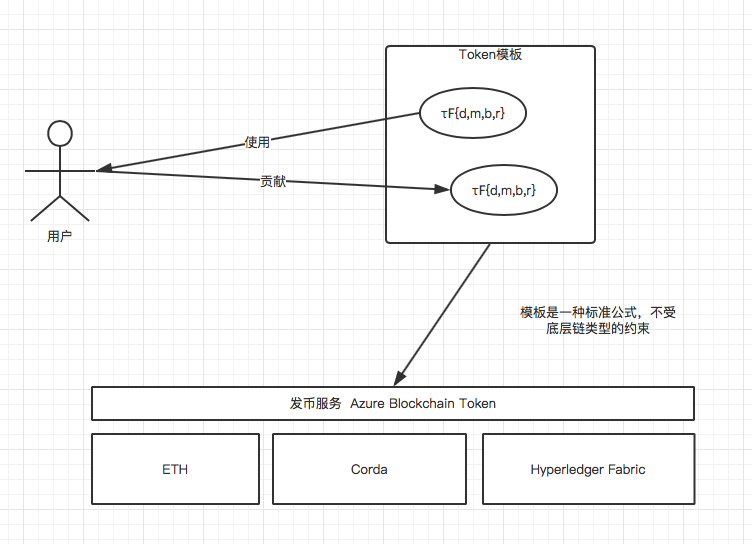
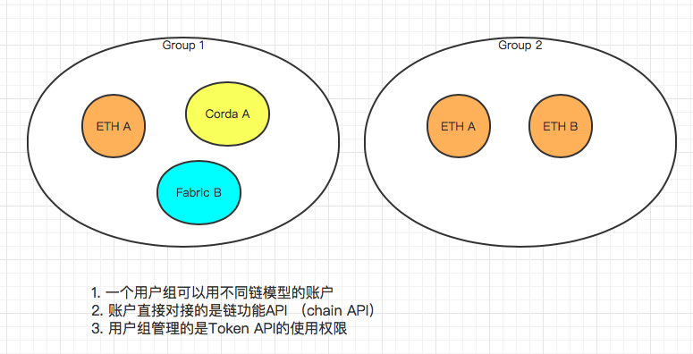

# AzureBlockchainToken

> **[info] 官方文档**
>
> [https://docs.microsoft.com/zh-cn/azure/blockchain/tokens/](https://docs.microsoft.com/zh-cn/azure/blockchain/tokens/)

# 1 基本概念介绍

## 什么是Azure区块链令牌

使用 Azure 区块链令牌，你可以使用预建的令牌模板为区块链解决方案创建标准化令牌。 你还可以使用服务编写自己的令牌模板。 创建后，使用 Azure 区块链令牌进行连接，并在区块链上颁发令牌。 发出后，可以在多个区块链网络中管理令牌。

- Azure根据不同的链类型内置了不同的发币模板
- 你可以根据自己的需要选择模板马上发币
- 你也可以创建自己的发币模板

## 什么是模板

Azure 区块链令牌支持令牌模板可组合性，使你能够基于支持的行为创建自己的令牌模板。

Azure 区块链标记模板是一种标准化且可重复使用的模板，可简化基于分类帐的令牌的创建和部署。 模板包含一个公式，该公式基于[标记分类框架（.ttf）](https://docs.microsoft.com/zh-cn/azure/blockchain/tokens/templates)语法。 该语法包含标记的基本标记类型和行为集。

## 管理

Azure 区块链令牌提供 Azure 门户管理和 Api 来连接到现有的区块链网络。 目前，可以连接到Azure 区块链服务或其他以太坊系列区块链。
连接到一个或多个区块链网络后，你可以使用 Azure 区块链标记 Api 来颁发和管理要在区块链解决方案中使用的令牌。 使用 Api，你可以在你的业务应用程序和逻辑中集成令牌管理。 例如，可以使用 REST API 管理令牌，而不是直接在区块链上管理令牌。

## 区块链账户与组

你可以直接在已连接的网络上创建新帐户，而 Azure 区块链令牌会代表你管理你的帐户私钥。 使用组，可以将不同区块链帐户组合到多个网络中，并通过组来管理访问控制

### 区块链网络

Azure 区块链令牌可在一组区块链网络中部署和管理令牌。 可以将单个区块链分类帐或几个区块链分类帐连接到服务。

### 账户

对于连接到 Azure 区块链令牌的区块链网络，服务将创建和管理帐户私钥对，并执行事务签名和提交。 Azure 区块链令牌还提供标识映射，以匹配分类帐上具有公钥标识的帐户。

### 组

利用组，你可以跨连接的网络管理大量区块链帐户。 你可以跟踪和审核目录中哪些应用程序和用户能够通过 Azure 区块链令牌 Api 使用帐户。 例如，你可以将表示不同业务线或不同角色的一组帐户分组，并对区块链令牌进行分组。

## 令牌分类框架

TTF是从TTI工作组分离出来的一个框架，TTI定义了一种标准的Token分类模型，这种模型适用于所有的主流区块链账本模型，包括Ethereum, Quorum, Corda和Hyperledger Fabric。TTI工作组的主要目的是为了从商业级别定义数字币/令牌/Token的行为特征，把数字币的特征与数字币具体在每种类型公链上的实现剥离开来

> A template consists of a formula, which is based off the Token Taxonomy Framework (TTF) grammar. The grammar encompasses the base token type and the set of behaviors for the token.
> 
> For example, τϜ{d,m,b,r} token template describes a fungible base token that is sub-dividable, mintable, burnable, and has role support.
> τϜ 是令牌的基本类型
> {d, m, b, r}是令牌有的功能
> 

### 令牌基本类型

1. 可替代类型 τϜ。同币种的等值交换不会造成任何后果，例如A有1美元，B有1美元，A和B彼此交换各自的1美元，不会有任何后果。美元就是可替代型币种
2. 不可替代型𝜏N。例如一栋房子是一个“房币”。两个房币的价值不一定相等，因为它们背后的房子可能由于楼层、地理位置等原因价值不同
3. 混合型
    3.1 不可替代型为基础，可替代为部件的混合型。（Base on 𝜏N with τϜ segment）。例如演唱会门票，不同日期和时间的演唱会门票价值不等，但是同一天同一时间的，同一个作为区域的门票是等值的
    3.2 可替代型为基础，不可替代为部件的混合型。（Base on τϜ token with 𝜏N segment）。 例如抵押担保证券，担保性是可替代的，但是抵押的物资价值是不一样的。

### 令牌的功能
> [https://docs.microsoft.com/zh-cn/azure/blockchain/tokens/composability](https://docs.microsoft.com/zh-cn/azure/blockchain/tokens/composability)

- burnable (b) 销毁，持有者可销毁。例如信用卡积分
- Delegable(g) 委托。例如vote token的持有人可以通过转让token来委托别人帮忙投票
- Logable (l) 记录。例如你可以为一部电影的放映发行一种Token，电影每一次放映都需要显示一笔转账。最后可以根据电影放映的转账记录进行最终票房的分红。
- Mint-able (m) 发币。
- Non-subdividable or whole (~d) 不可分割。不能分成更小的货币价值。1美元就是1美元，不支持0.5美元
- Subdividable (d) 可分割
- Non-transferable (~t) 不可转账。
- Transferable (t) 可转账
- Roles (r) 角色
- Singleton(s) 唯一。For example, a museum artifact is a singleton token. Museum artifacts are unique. A token representing an artifact only has a single item in the supply.

### 内置token模型

1. Commodity tokens 商业Token : 𝜏F{~d,t,m,b,r} - fungible, whole, transferable, mintable, burnable, and have role support
2. Qualified tokens 资质证明Token: 𝜏N{s,~t} - non-fungible, singleton, and non-transferable。例如学位证书
3. Asset tokens 资产Token: 𝜏N{s,t} - non-fungible, singleton, and transferable。例如博物馆的一幅画

> Asset tokens may be confused with commodity tokens. The major difference between the two tokens is that asset tokens are inherently unique**(Token 本身数独一无二的)**, and value is independent of the type of token it is**（token的价值和token的种类无关）**. For example, a piece of art like an oil painting by an established artist is an asset token**（比如为一个画家原创的油画发一种token，这个token是asset token）**. However, an art print of the Mona Lisa is considered a commodity token**(但是 蒙娜丽莎的打印件我们会认为是商业token)**. Similarly, a property title is an asset token since the value exists in the subjective qualities of the property.

4. Ticket tokens 票据Token: 𝜏N{m,b,r} - non-fungible, mintable, burnable, and have role support.

# 2 使用流程介绍

